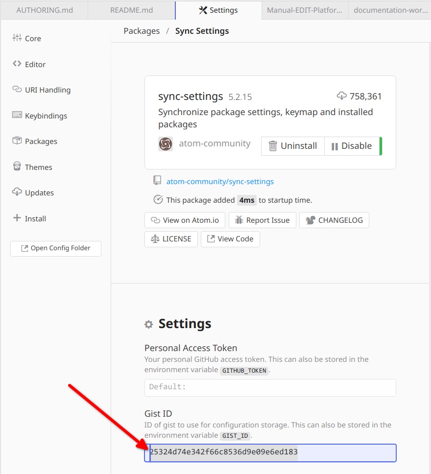
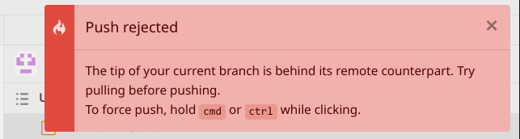

# Authors guide

This guide is dedicated to authors contributing to the "EDIT Platform manuals".

## General publishing workflow

The manuals are written in markdown, a lightweight markup language for creating formatted text using a plain-text editor. All markdown files, screenshot images and illustrations are hosted at github in [cybertaxonomy/EDIT-Platform-Manual](https://github.com/cybertaxonomy/EDIT-Platform-Manual).

The markdown documents can converted by pandoc, an a universal document converter, to PDF files or other formats like eBook or HTML. For this conversion style templates can be applied to provide a consistent and appealing layout.

This conversion process has been automated. Once changes to the source documents are pushed to the github repository ([cybertaxonomy/EDIT-Platform-Manual](https://github.com/cybertaxonomy/EDIT-Platform-Manual)) the EDIT continuous integration server will pick up the changes to create new PDFs, which subsequently will be uploaded to the download section of the EDIT Platform: [https://cybertaxonomy.eu/download/platform/manual/](https://cybertaxonomy.eu/download/platform/manual/). This process should not take longer than 5 minutes so that the result of changes applied by an author are quickly made public.

The markdown documents can be edited in the github site, where new images also can be uploaded.

For a more comfortable editing experience you can use [Typora](https://www.typora.io/) a markdown WYSIWIG editor or the [**Atom**](https://atom.io/) Editor (see next chapter)

## Tools

For easily editing the platform manuals offline we recommend using two tools:

* Typora
* Atom editor

**Which one to choose?**

The Atom editor has the advantage of being a fully integrated solution of a markdown editor with preview and all tool required for working with the git repository.

Typora has no built in git support but impresses with a WYSIWYG markdown editor for the pandoc markdown syntax. The image scaling feature of the pandoc markdown ( e.g.: `{width="12.3cm"}`) is not supported so that it can be hard to stay on top of things when working with many images which are not sized perfectly.
The latter problem losing overview does not exist in Atom, since images are scaled correctly. Markdown code and preview can are shown side by side in Atom.

Typora is not open source and longer fee of charge.

Even if Typora seems to excel at first glance due to the WYSIWYG editor it falls behind Atom after a short time of working with both editors.  

NOTE: The chapter on Typora has been moved to the end of this document.

## Atom editor

Atom is a free and open-source editor for Mac OS, Linux, and Microsoft Windows with support for plug-ins. It is highly customizable and can be adapted to as very user friendly Markdown Editor.

#### Pre: Install Pandoc

Pandoc is needed to render the preview view of the markdown documents in the Atom editor. Since pandoc is not distributable as Atom plugin, we need to install it as native application for your OS. For installing Pandoc please follow the instructions in
[https://pandoc.org/installing.html](https://pandoc.org/installing.html).

### Installing Atom and setup

The Installation and setup procedure involved three steps.

At first, we will download the editor and configure it using the **sync-settings** plugin. The presets are stored in a gist : [https://gist.github.com/akohlbecker/25324d74e342f66c8536d9e09e6ed183](https://gist.github.com/akohlbecker/25324d74e342f66c8536d9e09e6ed183) from where the plugin will fetch definitions on required plugins and sensible default settings.

Finally the *EDIT-Platform-Manual* project will be cloned to your local file system, so that you can start editing.

#### 1. Download and install Atom

Download from https://atom.io/ and install the application as usually on your operation system.

#### 2. Install plugins and setup the editor

Start the editor and click on "Install a Package" in the right pane below "Get to know Atom", or press the keyboard shortcut `Ctrl+,` to open settings page.
Click on *Install* and enter "**sync-settings**" in the search field and install this package by clicking on the blue *Install* button.

Once the package is installed: Click on Settings or Package Settings:

Enter the following Gist ID `25324d74e342f66c8536d9e09e6ed183` in the settings form:

Now you are prepared to import the settings from the Gist. Open the command palette with the key combination `Ctrl+Shift+p`, enter "sync" and click on  "Sync Settings: Restore"

Now you should be ready to get started with editing. All required plugins should be installed and configured

Quit ( Main menu : File > Quit or Exit; `Ctrl+q`) the Atom editor and start it again before proceeding to make the "Welcome" Windows and others disappear.

After the reboot of the Atom editor you will see the a "Sync-Settings" popup dialog:

Click on "Restore" to update the settings and close the next green dialog by clicking the "x" in the top right corner.

#### 3. Clone the EDIT-Platform-Manual project

**Requirements:** You need a GitHub account. In case you don't have an Account at GitHub yet, it is time to sign [up now](https://github.com/signup):

Press `Ctrl+Shift+8` to open the GitHub tab and follow the instructions to enter the authentication token. **Note**: Once you are on the github page to "Authorize Atom GitHub package" you need to make sure **cybertaxonomy** is checked in the **Organization access** section!

Now the github tab offers the option to clone a github repository:

Click on "Clone existing repository and enter `https://github.com/cybertaxonomy/EDIT-Platform-Manual.git` in the "Clone from" field in the following dialog.
You may also want to change the "To directory" path, to let Atom clone the repository to a folder of your choice.

Now click "Clone" and the content of the EDIT-Platform-Manual project tree should appear in the left hand "Project" pane:

You are ready to start editing now.

### Editing pandoc markdown with Atom

The individual manuals are in the sub folders prefixed with `Manual-EDIT-Platform-`. Open the manual folder you want to work on and double-click the markdown file (`*.md`). The file will open in the central editor and a set of buttons for working with markdown documents show up in the toolbar. Clicking the "Markdown preview" button (as shown in the screenshot below) will toggle the preview, to the right of the editor (alternatively you can use the command palette: `Ctrl+Shift+p` > "markdown-preview")

Above screenshot depicts other useful commands in the toolbar that help managing the editor UI:

* "Toggle git tab"
* "Toggle document outline"
* "Synchronize markdown preview"
* "Toggle markdown preview"

An Atom editor equipped with the [Markdown-Writer for Atom](https://github.com/zhuochun/md-writer) plugin makes it easy to work with markdown documents, since it adds tons of features.
Essential commands are available in toolbar provided by the [Toolbar for Markdown-Writer](https://github.com/zhuochun/tool-bar-md-writer). This toolbar makes common markdown syntax elements accessible by a simple click or dialog, so that it is not needed to consult the [Official Pandoc markdown syntax](https://pandoc.org/MANUAL.html#pandocs-markdown), even for  the unexperienced author:

#### markdown preview

**NOTE** The markdown preview is not a prefect representation of what will be the finally resulting PDF document after rendering the markdown files through the full pandoc/Latex rendering pipeline.

There are two limitations which should be noted here:  

The **synchronization** between markdown and preview can have a significant offset, especially in longer documents with many images. This is a known limitation, see [markdown-preview-plus issue 106](https://github.com/atom-community/markdown-preview-plus/issues/106)

Floating of text around images, which is provided by the **Wrapfig** module (see also below) can not be reproduced in the preview.

### Writing documents in Pandoc markdown

Reference documentation:

* [Official Pandoc markdown syntax](https://pandoc.org/MANUAL.html#pandocs-markdown)

Pandoc markdown is almost 100% compliant to other well known markdown flavors, but also extends the standard markdown syntax by crucial feature that are important for scientific writing. This includes capabilities to express layout rules for images, citations, etc.

#### Pagebreaks

pandoc markdown uses standard LaTeX tags for this purpose:

* `\newpage` : demand a pagebreak
* `\pagebreak` : request for a pagebreak

See [http://www.personal.ceu.hu/tex/breaking.htm](http://www.personal.ceu.hu/tex/breaking.htm) for additional information on "LaTeX Line and Page Breaking".

#### Images

Images for a specific manual like `Manual-EDIT-Platform-04-Working-with-the-TaxEditor` need to be stored in the according `./media/`-sub-folder and are references in the markdown by the relative file path: `{width="10cm"}`.

The syntax for adding images in markdown will add an image in full size either inline in the text flow ...

~~~
An image  in the text flow
~~~

or as new paragraph:

~~~
A new image paragraph

~~~

Pandoc markdown allows to resize images. The `width` property in curly brackets can be used to scale the image to a fixed with (e.g.: `{width="10cm"}`) or relative to the page width (`{width="33%"}`).

~~~
{witdh=50px}

{witdh=33%}
~~~

##### Wrapfig

More advanced positioning of images can be achieved by making use of "[pandoc wrapfig](https://github.com/akohlbecker/pandoc-wrapfig)". This pandoc filter extends the pandoc syntax by the option to use the [LateX wrapfig](https://www.ctan.org/tex-archive/macros/latex/contrib/wrapfig) module. The image in this paragraph is scaled to the width of 5cm and is positioned right aligned  {width="5cm"}. The text will be floating around the image if the markdown document is processed with the required pandoc and Latex parameters. Unfortunately this is not (yet?) possible in the Atom editor preview, since "pandoc wrapfig" support has not yet been configured. Advanced pandoc filters like "pandoc wrapfig" are only applied when the final document is being rendered. This the final result can only be seen in the pdf files that are produced by the `make-pdf` scripts in the respective manual sub folders.

**Usage**

Simply include ` {x}` at the end of the captions for figures that are to be
wrapped. `x` is a number that specifies the width of the wrap in inches. Setting
it to 0 will cause the width of the figure to be used (as per the wrapfig
package instructions). Figures without the tag will float as usual.

Optionally precede x with a character in the set `{l,r,i,o}` to set wrapfig's placement parameter, or the uppercase variants `{L,R,I,O}` to let the image flow in the wrapfig box. By using the float feature images hanging over page breaks can
be avoided. **default is `'L'`. . Optionally follow ?  with a '-' and another width
specification to set wrapfig's overhang parameter and push the figure that far
into the margin.

placement parameters:

fixed | float | description
------|-------|-----------------------------------------------------
r     | R     | right side of the text
l     | L     | left side of the text
i     | I     | inside edge–near the binding (if [twoside] document)
o     | O     | outside edge–far from the binding

fro more information please see the [pandoc-wrapfig README.md](./pandoc-filters/pandoc-wrapfig/README.md)

**Images can be added the following ways:**

1. Enter the image markdown syntax manually
1. Copy an Image to the clipboard and paste in to the markdown script. The Image will automatically be saved in the `./media` sub-folder relative to the document.
2. Drag an image from your system file explorer to the markdown script. The Image will copied to the `./media` sub-folder relative to the document.

**Note**: The above image copy, save and naming schema can be changed in the "Markdown Image Assistant" settings.

Images can be added by using this toolbar button , the dialog that will open up. Even if this dialog is offering field for "Width", "Height", and "Alignment", entered values are not applied - Reason unknown.

#### Cross-references

**TODO** ...

#### Footnotes

**TODO** ...

### Committing and pushing your changes

Open the "Git Tab" either via the toolbar or by pressing `Ctrl+Shift+9`.

The "Git Tab" will show all modified, added or removed files in the "Unstaged Changes" pane:

1. To **stage** your changes, click on "Stage All"
2. Enter a commit message to briefly describe your changes
3. **Commit** the changes to main

Now your local clone of the git repository has been updated. As last step you now need to **push** your changes to the remote repository at github, which is the reference repository in our workflow.

The git history log shows all commits which have not yet been pushed with an "Undo" button. To push these Changes  

4. Click on "Push" in the footer bar. The number to the right of the button label indicates how many commits will be pushed.

However, if someone else intermittently has pushed changes to the git repository the push action will fail with the following message:

Even if the dialog mentions the option to **force push, you should never do so!!!!**

**NOTE:** Force push will overwrite the changes of others!

Click again on the same button, which now has changed its label to ""**pull**"". Once the remote changes an integrated in your local clone you can push your changes.

### Typora

**NOTE:** Typora is no longer fee of charge. You only can get 15 days free trial. After that you need to purchase the application for $ 14.99.

**NOTE:** You may want to try the Atom editor fist! See next chapter.

Typora will support you while editing the manuals by providing an editable preview of the documents. The preview does not reproduce the resulting layout perfectly but you might find it much more comfortable than editing the plain markdown.

Since Typora has no built in git support, you may also want to install a user friendly git application like GitHub Desktop.

#### Installation and setup

Download the Typora for [https://www.typora.io/#windows](Windows), [Mac](https://www.typora.io/download/Typora.dmg) or [Linux](https://www.typora.io/#linux) and install the application.

It is highly recommended to adjust the setting before you start editing the EDIT Platform manual:

Open the *Preferences* via the main menu: *File > Preferences ...*:

**Appearance:**

**Editor:**

**Image**

These settings are EXTREMELY IMPORTANT!!!

**Editor:**

#### Authoring in Typora

After opening a EDIT Manual markdown file like `./EDIT-Platform-Manual/Manual-EDIT-Platform-04-Working-with-the-TaxEditor/Manual-EDIT-Platform-04-Working-with-the-TaxEditor.md` you will see the document in the WYSIWIG editor in the right part of the application window and the **Overview** on the document structure in the left hand pane:

The actual content is preceded by a document header (blue rectangle). In this header document metadata are defined as well as important configuration parameters for the final layout. This header must not be modified expect you exactly know what you are doing.

##### Images

Images for a specific manual like `Manual-EDIT-Platform-04-Working-with-the-TaxEditor` need to be stored in the according `./media/`-sub-folder and are references in the markdown by the relative file path: `{width="10cm"}`. Therefor it is important to configure Typora so that it always uses this relative path (see above).
The `width` property in curly brackets can be used to scale the image to a fixed with (e.g.: `{width="10cm"}`) or relative to the page width (`{width="33%"}`).

**IMPORTANT**

* **YOU NEVER MUST USE** the **zoom image** function as this will transform  markdown images `` to html images `` which will not work in our setup. (This will maybe improved in future, see https://github.com/typora/typora-issues/issues/249)

### GitHub Desktop

GitHub Desktop makes it easy to commit and push your changes to GitHub and to keep track of the modifications that have been applied by others.

[GitHub Desktop](https://desktop.github.com/) for runs on Winows and Mac OS. The Windows edition can be downloaded from [https://central.github.com/deployments/desktop/desktop/latest/win32](https://central.github.com/deployments/desktop/desktop/latest/win32).

The process of installing GitHub Desktop and git, as well as setting up a GitHub account is described in [Setting up GitHub Desktop](https://docs.github.com/en/desktop/installing-and-configuring-github-desktop/installing-and-authenticating-to-github-desktop/setting-up-github-desktop).  

For working with GitHub Desktop the documentation on [Committing and reviewing changes to your project](https://docs.github.com/en/desktop/contributing-and-collaborating-using-github-desktop/making-changes-in-a-branch/committing-and-reviewing-changes-to-your-project) and [Pushing changes to GitHub](https://docs.github.com/en/desktop/contributing-and-collaborating-using-github-desktop/making-changes-in-a-branch/pushing-changes-to-github) should be sufficient to get started.
