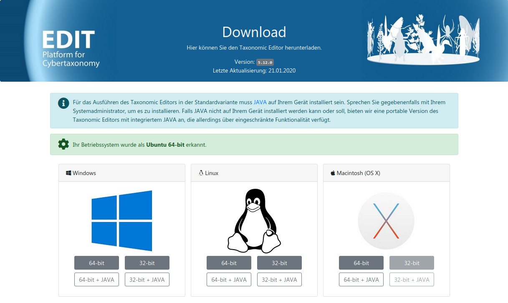
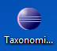
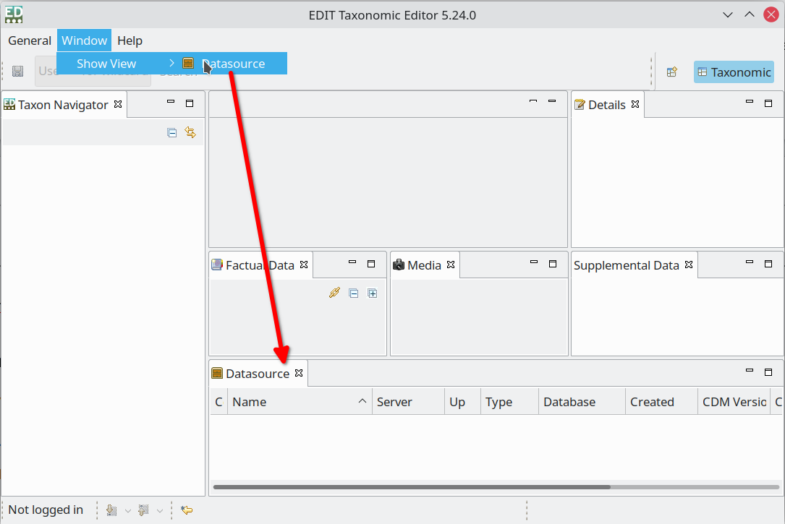
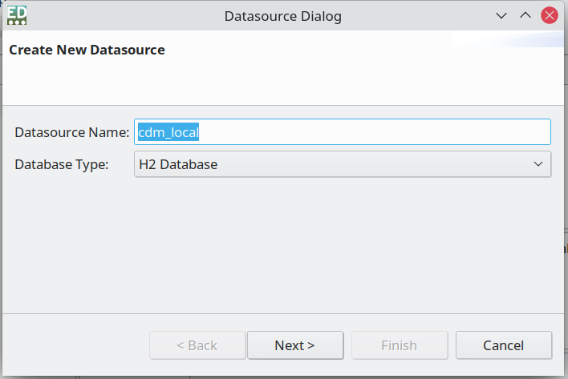
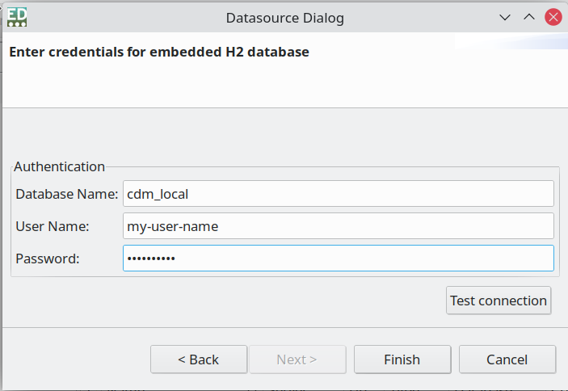
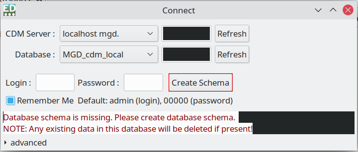
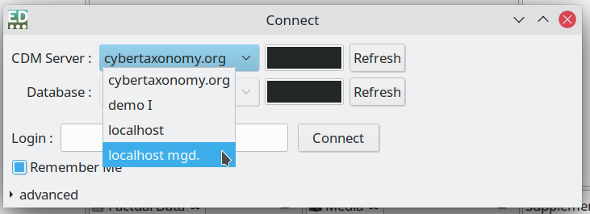
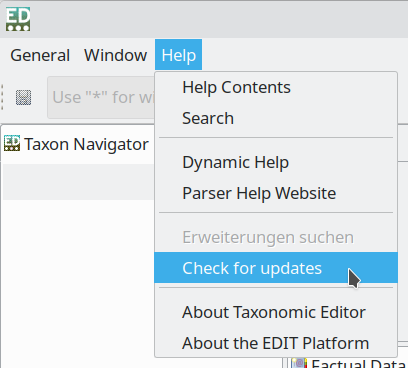
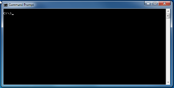

{width="6.527777777777778in" height="2.4618055555555554in"}

TaxEditor

User manual part 1:

Software Installation and Updates

Version: 22 August 2021

Contents

[1 First-time installation [1](#first-time-installation)](#first-time-installation)

[2 Standalone set-up for individual users [2](#standalone-set-up-for-individual-users)](#standalone-set-up-for-individual-users)

[3 Updates [4](#updates)](#updates)

[3.1 Check for updates [4](#check-for-updates)](#check-for-updates)

[3.2 Update manually [4](#update-manually)](#update-manually)

[4 JAVA [4](#java)](#java)

[4.1 Testing for JAVA presence and version under Windows [4](#testing-for-java-presence-and-version-under-windows)](#testing-for-java-presence-and-version-under-windows)

[4.2 Installing 64-bit JAVA [4](#installing-64-bit-java)](#installing-64-bit-java)

[5 Potential problems [5](#potential-problems)](#potential-problems)

[5.1 Administrator rights required [5](#administrator-rights-required)](#administrator-rights-required)

[5.2 Editor does not start after installation [5](#editor-does-not-start-after-installation)](#editor-does-not-start-after-installation)

# First-time installation

Go to [[http://cybertaxonomy.eu/download/taxeditor/stable/]{.underline}](http://cybertaxonomy.eu/download/taxeditor/stable/)

The software is available for the operating systems Mac OS X, Linux, or Windows (Vista, 7, 10). For Linux and Windows, please check, if you have the 64 or the 32bit version (in Windows 7: *Start Menu*, right click on *Computer* and select *Properties*; in Windows 10, *Start Menu* -- *Configuration -- System -- About*).

At the download site, you find a list of the three standard operating systems, the one your browser identified is highlighted, you can choose between a 64-bit version with or without JAVA.

{width="5.090551181102362in" height="3.0393700787401574in"}**It is highly recommended to install a version without JAVA (buttons with grey background below**[^1]**).** The versions with JAVA should only be used if you don't have JAVA installed on your machine and if there no way for you to get it installed (see 4.2 and 5). Automatic updating the Taxonomic Editor will not work with the JAVA versions. Manual installation would be required in this case (see 3.2) whenever an update is published. The Paragraph 4.1 explains how to check for JAVA under Windows.

The downloaded zip-file contains all files needed for the editor to run.

{width="0.48031496062992124in" height="0.4330708661417323in"}**Under Windows**, by default the zip file is downloaded to your Downloads folder. Please move it to your documents folder and unpack the zip file there[^2]. This will create a folder *EDIT Taxonomic Editor*. Within that folder, there is the file *TaxonomicEditor.exe.* Right click and drag the file to your desktop and create a shortcut there. Start the Editor by double clicking the shortcut or directly the TaxonomicEditor.exe.\
**Under Linux**, unpack the zip file in your Documents folder. This will create a folder EDIT Taxonomic Editor. Run the executable file TaxonomicEditor.exe within that folder to start the editor.\
**On your Mac**, simply execute the file.

# Standalone set-up for individual users

The \"Individual Installation\" set-up provides single users, which do not require collaborative data management capabilities, with easy to maintain installation of the TaxEditor with one local database that is managed internally by the TaxEditor.

{width="5.040277777777778in" height="3.3680555555555554in"}Once the TaxEditor has started, open the "*Data source*" pane by the menu: *Window \> Show View \> Datasource.*

Now you can create a new local data source by doing a right click and selecting "New" from the context menu. A dialog will pop up where you can name your data source. Since you are about creating a local data base you need to choose "H2 Database" as "Database Type", click next and fill the form in that dialog. Use can use the same name for data base as for the data source in the previous dialog.

{width="2.952755905511811in" height="1.9724409448818898in"}{width="2.932638888888889in" height="2.0194444444444444in"}

**NOTE:** With the current version of the TaxEditor, you have to use "sa" for the username and leave the password empty, otherwise you will not be able to connect to the h2 database!

Click "Finish" to create the database.

NOTE: On Window you may be warned by a Firewall dialog about an unexpected access. Click the corresponding button to allow the TaxEditor connecting its internal h2 database server.

Now that the data base is created, you no longer need the "Datasource" dialog and you can close it if you want to.

{width="3.3618055555555557in" height="1.4326388888888888in"}{width="3.4090277777777778in" height="1.2361111111111112in"}For the initial setup of the database, open the connection dialog via the menu: *General \> Connect*. In the dialog select "localhost mgd." You will see a warning that the database schema is missing. Click the "Create Schema" button. Creating the schema and starting the database will take a while.

Now the database is set up and ready to use. When you start the Editor, you choose "localhost mgd" as the CDM-Server in order to work with it.

3.  # Updates {width="2.091666666666667in" height="1.8847222222222222in"}

    1.  ## Check for updates

If you are asked to update your TaxEditor when trying to connect to a data source, use *Help - Check for Updates* in the TaxEditor menu*.*

## Update manually

See First-time installation above.

4.  # JAVA

    1.  ## Testing for JAVA presence and version under Windows

{width="1.617361111111111in" height="0.8229166666666666in"}Open the command prompt window (Windows 7: *Start Menu -- Other Programs -- Accessories - Command Prompt;* Windows 10: *Start Menu -- All apps -- Windows System -- Command Prompt*).[^3]

Type *JAVA* *-version* at the prompt and press *enter.* If you are getting a message that the command is not recognised, you should install JAVA (or use the JRE-version of the TaxEditor). Otherwise, the returned message identifies the version of JAVA you are running. Make sure you have JAVA version 8 (i.e. "1.8"). The output of the command will be start with:

java version \"1.8.\
\
If you are running the JAVA 64-bit version, the text output should include \"*64*-*Bit*\".

## Installing 64-bit JAVA 

Please note that for the 64bit version of the TaxEditor, you have to have JAVA 64bit installed. If this is not the case, go to [[https://java.com/en/download/manual.jsp]{.underline}](https://java.com/en/download/manual.jsp) to download and install Windows Offline (64-bit). You need administrator privileges on your computer to do so, so you may have to ask your network administrator or IT department do so.

Follow the instructions on the website: [<https://java.com/en/download/manual.jsp>.]{.underline}

#  

# Potential problems

Currently, known problems with the TaxEditor installation have always been related with JAVA or (often connected to that) insufficient security privileges of the User.

## Administrator rights required 

The TaxEditor is not formally installed under Windows, so there are no changes to your registry or your system folders. At first start, a hidden directory *.cdmLibrary* in your user home directory is created, which is used to store some internal program data. If you have normal user rights on your computer, this should not require administrator rights. Otherwise, please contact your system administrator.

You may also need help to install JAVA 64-bit.

## Editor does not start after installation

In case your Editor does not start (in Windows 10) or ends up with a cryptic JAVA error (in Windows 7), make sure that you have JAVA installed, and that you have the 64bit version of JAVA installed for the 64bit version of the TaxEditor. In case you want to go ahead without help from the administrator, use the JRE version of the TaxEditor with JAVA included.

[^1]: Normally, the version appropriate for your operating system will be highlighted in green on the download page.

[^2]: The TaxEditor is not using the Windows installation process, so it can be executed from the documents folder, where normally all users have the necessary security privileges to do so (but note section 5 below).

[^3]: If you don't see this program under Accessories, please consult your Administrator.
