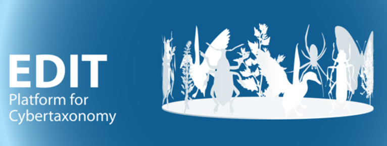

{width="6.527777777777778in" height="2.4618055555555554in"}

User manual part 2:

The EDIT Platform Demos

Version: 15-Sept-21

**Contents**

[1 Introduction [1](#introduction)](#introduction)

[2 The databases [1](#the-databases)](#the-databases)

[3 The Data Portals [2](#the-data-portals)](#the-data-portals)

Version history:

23-Aug-21: Test and minor updates; 15-Sept-21: Minor edits.

# Introduction

For demonstration and training purposes, we provide "sandbox" installations of the EDIT Platform. These are open for use by anybody wanting to experiment with the TaxEditor component of the Platform and see the results as a web-publication in the Platform's data portal.

Naturally, the data portals used in this context do not show all the features that may be implemented -- have a look at those listed under [[https://cybertaxonomy.eu/DataPortalReference]{.underline}](https://cybertaxonomy.eu/DataPortalReference) to get an impression of different layouts, the selection of interactive elements and the different output formats that can be implemented.

# The databases 

There are a number of EDIT Platform demonstration databases on two servers available on-line (note that not all may be available at any one time).

To open them in the TaxEditor, use the menu option *General* -\> *Connect*. In the following dialog choose the *CDM Server* **"edit-WS I"** or **"demo I"** and one of the *databases*.

Currently the demo is set up to allow parallel use of 5 databases with the same data, in order to support EDIT Platform workshops (the databases are numbered \_01 to \_05).

Those called *empty_demo* let you start with a completely unpopulated database, the others contain content from several publicly available datasets (usually not in the most up-to-date stage, though):

-   Caryophyllales_demo contains data taken from the generic checklist of Caryophyllales

-   FaunaEuropaea_demo is the dataset of the Fauna Europaea checklist

-   Cuba_demo is the original dataset of the Checklist of the Vascular Plants of Cuba.

The *Login* for all demo databases is "**admin**" and the *Password* "**00000**".

**Please note that the demo databases are reset every night at 6:00 CET.**

{width="3.490972222222222in" height="1.5604166666666666in"}

Click on *Connect* to start working with the respective database in the TaxEditor*.*

# The Data Portals

The respective data portals are available on the webserver <http://ws1.cybertaxonomy.org> entry page. (Again, please note that not all portals may be available at any one time.)

You can follow your changes in the database directly in the dataportal.

You do not have to log in at the data portal to look at the data.
