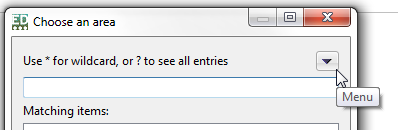

{width="6.527777777777778in" height="2.4618055555555554in"}

User manual part 3:

TaxEditor

Introduction and Tutorial

Version 15-Sept-2021

**Version history: 8-Sept-21: Title changed; editorial revision. 15-Sept-21: Minor editorial, replaced *Name editor* with *Taxon editor.***

**Contents**

[1 Accessing a database in the TaxEditor [1](#accessing-a-database-in-the-taxeditor)](#accessing-a-database-in-the-taxeditor)

[2 Basics: general behaviours and navigation [2](#basics-general-behaviours-and-navigation)](#basics-general-behaviours-and-navigation)

[2.1 Main parts of the TaxEditor interface [2](#main-parts-of-the-taxeditor-interface)](#main-parts-of-the-taxeditor-interface)

[2.2 Mouse and Keyboard Functions [3](#mouse-and-keyboard-functions)](#mouse-and-keyboard-functions)

[2.3 Subwindows -- Basics [3](#subwindows-basics)](#subwindows-basics)

[2.4 Dialog boxes [5](#dialog-boxes)](#dialog-boxes)

[2.5 Wildcards [5](#wildcards)](#wildcards)

[3 Basics: creating and saving a taxon record [6](#basics-creating-and-saving-a-taxon-record)](#basics-creating-and-saving-a-taxon-record)

[4 Basics: Details and Caches [10](#basics-details-and-caches)](#basics-details-and-caches)

[5 Basics: Editing and choosing data in the *Details* view [11](#basics-editing-and-choosing-data-in-the-details-view)](#basics-editing-and-choosing-data-in-the-details-view)

[6 Basics: Factual Data [12](#basics-factual-data)](#basics-factual-data)

[7 Important terminology [14](#important-terminology)](#important-terminology)

The TaxEditor (for "Taxonomic Editor") is the desktop application used to edit data stored in the CDM (Common Data Model) database hosted on a CDM Server. This editor is a tool designed for specialists -- knowledge of taxonomy and biological nomenclature are a prerequisite for its use.

# Accessing a database in the TaxEditor 

Start your Editor either from the shortcut on your desktop or by double-clicking the TaxonomicEditor.exe directly.

As an example, we use an empty demo database (also see "Manual-EDIT-Platform-02-DEMO"):

In the menu, choose *General* -\> *Connect*. In the following dialog choose the *CDM Server*\
"**edit-WS I"** and the *CDM Instance* "**empty_demo\_##**" (where \## stands for a number from 01 to 05; if you are on your own, you can use any of these, in a workshop the group number is issued to you).

The default *Login* is "**admin**" and the *Password* "**00000**".

{width="3.490972222222222in" height="1.5604166666666666in"}

Click on *Connect.*

Now you are ready to try the TaxEditor!

2.  # Basics: general behaviours and navigation

    1.  ## Main parts of the TaxEditor interface

{width="6.8125in" height="0.5444444444444444in"}The user interface of the TaxEditor is highly configurable. Basically, it consists of a **Toolbar** area on the top and a number of **Subwindows** below that take up most of the space.\
In the Toolbar area, there is the main menu and, below, a row with a series of tools: a button to save your changes, a search bar to search within your data set, and, to the right, a selector to choose the "perspective", i.e. a standard pre-configuration of the set of subwindows below the toolbar. We will start to work with the "Taxonomic perspective".

{width="6.527777777777778in" height="2.6350667104111984in"}

Figure 2: TaxEditor Subwindows

{width="6.527777777777778in" height="2.8805555555555555in"}The subwindows has a kind of header that indicates its content, displayed as a **Tab.** Several subwindows may be united into a **Pane** -- the individual subwindows can then be accessed using the tabs at the top:

## Mouse and Keyboard Functions

In all sections of the TaxEditor except the top menu clicking the **right mouse button** will open up a **context menu** containing a list of possible commands that can be performed on the data element the mouse is pointing at. When no commands are available a right-click will have no effect.

Most of the commands described here are using the mouse. However, it is also possible to use the keyboard for some functions. Notably, when pop-up boxes require confirmation by selecting 'OK' or 'Finish', the default setting will be on the OK/Finish button, therefore you can select OK/Finish by pressing Return on the keyboard as well as by clicking the button with the mouse.

Under MS-Windows, keyboard arrows can be used to navigate around the Toolbar area to find menu options and make selections. Click on one of the menu items or press the Alt-key, then you can use the arrows on the keyboard to navigate within the menu and the Return/Enter key to make your selection.

To change the active subwindow of the TaxEditor use the mouse; clicking in a subwindow will activate it.

## Subwindows -- Basics

In the taxonomic perspective, the main subwindows have the following functions:

{width="6.464162292213473in" height="3.784108705161855in"}

In the following, we will call these subwindows *Taxon Navigator, Taxon Editor, Factual Data* view and *Details* view. (In addition the *Supplemental Data* view may have opened below the *Details* view and the *Media* view besides the *Factural Data* view.)

The individual subwindows can be closed, opened, sized and arranged according to your needs and preferences. For example, when you start a fresh installation of the TaxEditor you have the *Taxon Navigator* on the left. {width="1.9784722222222222in" height="0.6555555555555556in"}Close it by clicking on the X in the tab:

{width="3.886111111111111in" height="0.9916666666666667in"}To open it again, go to the menu:\
*Window* -\> *Show View* -\> *Taxon Navigator*.

It works this way for most of the subwindows that are available in the TaxEditor.

{width="0.4777777777777778in" height="0.36527777777777776in"}{width="2.49375in" height="0.6680555555555555in"}As in other applications, you can enlarge or minimise a window by clicking on the symbols on the top right. The subwindow closes with a click on the x at the tab.\
You can move subwindows with the mouse. Try moving the *Details* view. Grab it with the mouse pointer at the top and move it around. You can make it into a tab in an existing pane by dragging it onto a subwindow tab in that pane.

Try to restore the original screen, with the *Taxon Navigator* to the left, the *Taxon Editor* centre top, the *Factual Data* centre bottom and the *Details* to the right.

On the top right of the TaxEditor Interface, you can choose a *Perspective.* These are pre-arranged sets of subwindows for special purposes.

When you exit the TaxEditor using the menu *(General -\> Exit)*, your last subwindow settings will be preserved. \[NB: Currently this feature is disabled.\]

## Dialog boxes

Dialog boxes are invoked whenever a function involves direct interaction with the user.

{width="2.7194444444444446in" height="0.8881944444444444in"}In dialogs that allow you to select data from catalogues (e.g. person names, bibliography, geographical areas), clicking on the triangle to the right opens a context menu.

## Wildcards

In selection dialogs as well as in searches you can use the asterisk "\*" as a wildcard, e.g. "Bal\*" will search for all records starting with "Bal", "\*bal" will search for all records ending in "bal". But note that some selection dialogs will automatically set the "\*" in the end while you are typing, to show you the matching records immediately.

# Basics: creating and saving a taxon record

For a first demonstration of the capabilities, we will create our own classification, add a taxon and have a look at what happens in the Web interface.

Connect to one of the empty_demo databases.

{width="3.6125in" height="3.0in"}Right click on My Classification in the *Taxon Navigator, -\> Open in .. -\> Classification Wizard*, and change the Label from "My Classification" to a label of your choice -\> *Finish*.

{width="3.6125in" height="2.720138888888889in"}

Add a taxon: Right click on your new classification in the *Taxon Navigator*\
*-\> New -\> Taxon*

Enter a taxon name, e.g. "Agave mexicana Lam." -\> *Finish*.

By leaving the *Open in Editor* choice tagged, we had asked to have the new taxon opened in the *Taxon Editor*, and that's what happens, it appears in the central *Taxon Editor* window.

{width="6.527777777777778in" height="1.6416666666666666in"}

{width="1.5916666666666666in" height="1.25in"}N.B.: The new taxon was automatically saved in the database. Once you change anything in the *Taxon Editor* or its *Details View*, you will have to explicitly save it:

{width="2.625in" height="0.8645833333333334in"}

NB: A leading asterisk on a *Taxon Editor* tab indicates that the record has not been saved. Always use Ctrl-S or the *Save* button after making changes.

{width="3.3555555555555556in" height="3.904861111111111in"}

However, if you don't want to save the changes, click on the closing x on the tab. A dialog will appear asking you what to save (you may have several unsaved changes).

Just untag the parts you don't want to save and click OK.

We can have a look at our data in the respective Data Portal: Paste the following link into your browser: [[http://ws1.cybertaxonomy.org/dataportal/empty_demo\_##/]{.underline}](http://ws1.cybertaxonomy.org/dataportal/empty_demo_) (where \## stands for a number from 01 to 05, in accordance with the database you opened).

Under Data output, you will find *A. mexicana* in the *Classification* section (which corresponds to the hierarchy in the *Taxon Navigator* of the TaxEditor). A double-click on the name opens the taxon page for our entry (up to now without much data).

{width="6.527777777777778in" height="5.004166666666666in"}

# {width="2.7680555555555557in" height="2.2243055555555555in"}Basics: Details and Caches

Have a look at the *Details* view to the right on your screen.

Note that the name has actually been parsed into its data elements (Genus, epithet, author, rank).

First you will note that there is a certain duplication of data elements. There are so-called "Cache" elements and the broken down atomic data elements.

{width="0.43680555555555556in" height="0.4263888888888889in"}With "good data", the "Caches" are texts that have been put together from other, more "atomized" elements (like in this case).\
You cannot directly enter data into the cache fields, as\
long as you did not open the padlock beside the cache,\
as shown.

{width="2.7569444444444446in" height="2.303472222222222in"}Try to open the *Cache* field in the *Name* section.\
The "atomized" data present that are not used to calculate the cache are than highlighted. Try and change the name in the *Cache*.

{width="0.2701388888888889in" height="0.28055555555555556in"}Save and have a look at your data portal: http://ws1.cybertaxonomy.org/dataportal/demo\_##/

**The Output always represents the Cache data, even when atomized data exist.**

We can use the cache fields to store preliminary unstandardized data (as they often result from data imports), but also to create\
preliminary designations, e.g. for Clades in the taxonomic hierarchy.

Switch back the padlock to its locked position.

{width="0.2701388888888889in" height="0.28055555555555556in"}The Cache record **will be overwritten** by the concatenated value.

Don't forget to Save!

# Basics: Editing and choosing data in the *Details* view

{width="3.4118055555555555in" height="1.367361111111111in"}\
Throughout the TaxEditor, there are a few further symbols for specific functions. Let's try these in the *Authorship* section of the *Details* window.

{width="1.051388888888889in" height="0.6743055555555556in"}

> {width="1.832638888888889in" height="0.47847222222222224in"}The folder button opens a search interface for existing data items. If you don't find anything, you can enter a new one. Try to change the author from "Lam." to "Hernández".\
> \
> You will have to create a new Person for that.\
> Enter the "Abbreviated Title (= Standard author abbreviation) and watch out for the cache setting!)

{width="1.0118055555555556in" height="0.75625in"}The *Edit* button directly opens the entry and lets you change it**[. Use it with caution:]{.underline}** with full rights **the changes here** **will change all occurrences** of the entry in the database! For example, if you change "Lam." to "Hernández" using this function, all names in the database with author Lam. will be changed to author Hernández.

{width="1.0625in" height="0.71875in"}

The garbage bin button will remove the selected item from this record -- it will not delete it from the database. Try to remove it and put it back using the *Browse existing* button.

{width="1.1291666666666667in" height="0.7722222222222223in"}{width="1.0444444444444445in" height="0.7034722222222223in"}Further symbols:

In the *Factual Data* window you find these + / - symbols. They work similarly to the triangles in the *Taxon Navigator*, opening and closing subordinate items.

When you find a + symbol directly after an entry prompt, it means that there are additional data.\
The (larger) + symbol to the right allows you to add an entry:

{width="3.3329166666666667in" height="0.3541229221347332in"}

# Basics: Factual Data

"Factual data" are all information items added to a taxon (or a name) except those that directly concern the position in the taxonomic classification or those referring to nomenclatural information. To be able to add "Factual Data", you have to have a (saved!) Taxon selected in the *Taxon Editor*.

{width="2.4965277777777777in" height="0.6805555555555556in"}{width="2.5305555555555554in" height="0.47638888888888886in"}With a right click in the white space of the *Factual Data* view, you can add a factual dataset.\
Note that you can add more than one factual dataset (for example, if you want to add data from different sources that all use the same taxon concept).

{width="0.2701388888888889in" height="0.28055555555555556in"}(And don't forget to safe!)

{width="3.825in" height="2.859027777777778in"}Within the Factual Dataset, you can add different *Features*.

Right click on *Factual data for* and select (left click) -\> *New* for a selection of preconfigured and user defined\
features (the *Feature Tree*)[^1].

{width="5.229166666666667in" height="1.6833333333333333in"}Try *Common Name* to see that the *Details* window now displays the specific data for a common name: the name itself, its language, area of use, references and there might be also a recording of its pronounciation *(Media)*.

# Important terminology

It is important to understand how some terms are used in the context of the EDIT Platform and the TaxEditor and how they are related.

The ***Classification*** is the uppermost hierarchical element in the Platform 's handling of taxa. Several classifications can reside in a single database. This is useful, for example, when there are alternative views on taxon circumscriptions (e.g. in the treatment of the general Hieracium and Pilosella in the Cichorieae, see [[http://cichorieae.e-taxonomy.net/]{.underline}](http://cichorieae.e-taxonomy.net/)).

An accepted (correct) name nested within a classification designates a **Taxon Node,** representing a taxon in a given classification. If a taxon node is assigned to a taxon of a higher rank, the latter is referred to as the **parent taxon**, the former as the latter 's **child taxon**.

A **Taxon** is a taxonomic group with the data that define its circumscription and describe its properties. The circumscription of the taxon is indicated by means of a circumscription or concept reference **( "sec.-" or "secundum-" reference)**, normally a bibliographic reference clarifying the distinction of this taxon from other taxa. One and the same taxon may occur in several classifications, but it is also possible that two different taxa (taxon concepts) carry the same name in separate classifications.

In themselves, classifications should be taxonomically consistent, i.e. every name should only occur once (as a taxon name or a synonym) in a given classification (except when cited as a misapplied name).

Synonyms are names assigned to taxa -- the **syn.-sec. reference** indicates the reference that assigned the synonym to this taxon.

**Scientific names** (as well as the names given to pseudotaxa) are assigned to records representing taxa, syonyms or misapplied names.

**Ranks of names** follow the hierarchy defined in the nomenclatural codes. However, you are free to insert further ranks at any place in the tree thus forming new or mixed hierarchical levels.

[^1]: To select, which features are available for Factual Data entry go to the menu, *Preferences -\> Taxonomic Editor -\> Description -\> Features* and make your selection.
