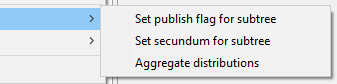
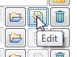
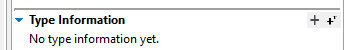

---
title: "User manual part 4 - Using the TaxEditor"
subtitle: "Version: 15-Sept-2021"
author: [Walter Berendsohn, Andreas Kohlbecker]
subject: "EDIT Platform user manual 4"
keywords: [EDIT Platform, TaxEditor]
lang: "en"
linkcolor: blue
citecolor: blue
urlcolor: blue
toccolor: black
titlepage: true
titlepage-text-color: "FFFFFF"
titlepage-rule-color: "FFFFFF"
titlepage-rule-height: 0
titlepage-background: "Titel-A4.png"
toc-own-page: true
mainfont: "Arial Unicode MS"
header-includes:
- \usepackage{wrapfig}
- |
    \usepackage[export]{adjustbox}
    \let\includegraphicsbak\includegraphics
    \renewcommand*{\includegraphics}[2][]{\includegraphicsbak[frame,#1]{#2}}

...

Version history:

* 26-Aug-21: Major restructuring, excluded tutorial.

* 15-Sept-21: Additions to glossary, editorial, changed Name Editor to Taxon Editor, Taxonomic Editor to TaxEditor.

\newpage

# Installing the TaxEditor

Please refer to the TaxEditor User Manual part 1 (Installation and Updating)

# The EDIT Platform demos

Please refer to the TaxEditor User Manual part 2 (Platform Demos)

# An introduction to the TaxEditor

Please refer to the TaxEditor User Manual part 3 (TaxEditor Introduction and Tutorial)

# Working with the TaxEditor

## Understanding the structure

It is important to understand how some terms are used in the context of the EDIT Platform and the TaxEditor and how they are related.

The **Classification** is the uppermost hierarchical element in the Platform's handling of taxa. Several classifications can reside in a single database. This is useful, for example, when there are alternative views on taxon circumscriptions (e.g. in the treatment of the general *Hieracium* and *Pilosella* in the *Cichorieae*, see [http://cichorieae.e-taxonomy.net/](http://cichorieae.e-taxonomy.net/)).
An accepted (correct) name nested within a classification designates a **Taxon Node,** representing a taxon in a given classification. If a taxon node is assigned to a taxon of a higher rank, the latter is referred to as the **parent taxon**, the former as the latter's **child taxon**.
A **Taxon** is a taxonomic group with the data that define its circumscription and describe its properties. The circumscription of the taxon is indicated by means of a circumscription or concept reference **("sec.-" or "secundum-" reference)**, normally a bibliographic reference clarifying the distinction of this taxon from other taxa. One and the same taxon may occur in several classifications, but it is also possible that two different taxa (taxon concepts) carry the same name in separate classifications. In themselves, classifications should be taxonomically consistent, i.e. every name should only occur once (as a taxon name or a synonym) in a given classification (except when cited as a misapplied name).
The **syn.-sec. reference** indicates the reference that assigned the synonym to this taxon.
**Scientific names** (as well as the names given to pseudotaxa) are assigned to records representing taxa, synonyms or misapplied names. **Ranks of names** follow the hierarchy defined in the nomenclatural codes. However, in the taxonomic hierarchy you are free to insert further nodes at any place in the tree thus forming new or mixed hierarchical levels -- if these are not named according to the codes, we call them **Pseudotaxa**.

## Working with the *Taxon Navigator*

### Display

The *Taxon Navigator* displays the classifications and, within those, a hierarchical tree of the contained taxon nodes, i.e. taxa. It won't display synonyms or other non-accepted names. In its default position, the *Taxon Navigator* Window is the leftmost subwindow ("view") in the TaxEditor interface. If you don't find it, remember that you can call up windows using the Menu: *Window --\> Show view --\> Taxon Navigator*.

{width="10cm"}

You can change the order to alphabetical order of names in the Menu under *Window --\> Local Preferences -\> UI -\> Taxon Navigator*. Please note that you have to close and open the Navigator window for the changes to take effect.

{width="67%"}

The taxon tree is indented according to the sequence of ranks, e.g. all families are listed below their order. However, you are free to insert names independent of their ranks at any place in the tree, thus forming new or mixed hierarchical levels. For example, some classifications may not cite the species for a given subspecies. The subspecies is then assigned directly to the genus and displayed on the same level as the rest of the species. You can also insert preliminary groupings or "pseudotaxa", such as species groups or clades. As a general principle, the program will alert you when it detects a deviation from nomenclatural rules, but it will not prevent you from entering the data you want to use.

A double-click on a Taxon Node in the *Taxon Navigator* will open the *Taxon Editor* (see section below), a right click on a Taxon Node will open the context menu.

### Context menu options in the *Taxon Navigator*

{width="6.04375in" height="4.45in"}

The context menu provides an overview of the operations that can be carried out with the *Taxon Navigator*. Note that, although you are effectively selecting a Taxon Node in the tree, the operations are actually carried out on the underlying taxon (except when you add a new child taxon).

-   *New* allows to add a new child taxon to the selected taxon node or to create an entirely new classification.
-   *Open in \...* gives access to a number of editors that allow you to change data of the selected taxon or data connected to that taxon (see 4.2.3).
-   *Change to synonym* can only be carried out with taxon nodes that do not contain any child taxa.
-   *Move taxon (with child taxa)* allows to select a new parent taxon.
-   *Move factual data to another taxon* allows to select a new taxon to which data such as the distribution, description etc. are to be linked.
-   *Import* allows you to add data from external sources in various formats.
-   *Export* allows you to export data and write them to a file in various formats.
-   *Delete* will remove the taxon node and -- if not used elsewhere -- the taxon and the name, in case you choose the respective options.
-   *Copy* creates a copy of the taxon node so that it can be pasted to another classification for example.
-   *Edit subtree* offers several options in a sub-menu 
    -   *Set publish flag for subtree* allows you to set or unset the flag that determines if the affected names appear in output (e.g. on the portal). It affects all child taxa of the selected taxon and you can configure if synonyms are included.
    -   *Set secundum for subtree* allows to change the sec.-reference for the selected taxon and all its child taxa. You can configure is syn.-sec. references are to be affected, too.
    -   *Aggregate distributions* invokes an algorithm the calculates a distribution record for the selected taxon from its child taxa.
-   *Set Flags ...* offers the options to set the taxonomic status flags *doubtful*, *unplaced*, and *excluded* for the selected taxon.
-   *Refresh* causes the Taxonomic Navigator being refreshed by loading all visible information from the data base.

Secundum reference, publish flag, and taxonomic status flags can also be edited via the *Taxon node edit dialog* which can be opened by choosing *Open in \...-\>Taxon node Dialog* (see below),

### The Taxon node edit dialogue in the *Taxon Navigator*

{width="50%"}

The taxon node edit dialog can be opened from the *Taxonomic Navigator* via the context menu *Open in \...-\>Taxon node dialogue*

The *Placement status* allows to mark a taxon in the classification as excluded, unplaced or doubtful and a reason for that classification may be stated in the *Status notes*. Excluded taxon nodes will remain in the hierarchy; excluded taxon nodes are displayed with a leading 'ø' character, unplaced with two interrogation marks '??' and doubtful with a single one '?'. Excluded taxon nodes are shifted to the end of the classification.
Please note that the definition of these categories is currently being discussed. At present, pseudotaxon-nodes are inserted to categorise such taxa and names that are not considered to belong to the core taxonomic backbone.

\[**TO BE REVISED**:\| Beside the options to modify the S*ecundum Reference*, *Publish Flag*, and taxonomic status flags of a single taxon node, this dialog also allows to change the *Taxon* to which the taxon node refers to and the *Parent Child Relation Source.* This source information references the publication or database in which the parent child relationship originally was published.

### Adding a classification in the *Taxon Navigator*

To add a classification, go to the *Taxon Navigator and* open the context menu of any Taxon Node with a right click. Choose -\> *New* -\> *Classification.*

### Moving taxa in the *Taxon Navigator*

You can move a taxon (actually: a taxon node) and its child-taxa simply by drag and drop. However, in a large taxon tree this may be tedious.
Alternatively, use the context menu: right click on the taxon you want to move, -\> *Move taxon (with child taxa),* then select the classification you want to move the taxon to, and search for the parent taxon in the chosen classification. With *OK* the taxon will be moved and becomes a child of the taxon selected in the dialogue.

### Change the status of a name

Accepted to synonym: right click on the name in the *Taxon Navigator*. Select *Change accepted taxon to synonym* and select the accepted name.

Synonym to accepted: Use the context menu of the synonym in the *Taxon Editor.*

## General *Search*

With the *Search* Function in the toolbar area of the TaxEditor you can search for scientific and common names in the database. Simply type a name into the textbox to the right of the save button and type \<enter\> or click on *Search.*

{width="4.53125in" height="2.165277777777778in"}

The drop-down menu to the right can be used to restrict the search to certain categories of names, e.g. common names or types of scientific names (correct names of taxa, synonyms, names that have not been included in the classification, unpublished names). It also offers the choice of including the authors of scientific names. You can use the asterisk \* as a wildcard, so, for example, the entry "\* Mill." will return all names that have Miller as the last author (if the *With authors* option is tagged).

{width="6.527777777777778in" height="2.5305555555555554in"}The search result appears in a subwindow below the *Taxon Navigator*.

Names that are not part of the classification (i.e. that are not designated as a taxon name or part of a synonym list) appear first in larger script. A black square before the name indicates a taxon, a green circle a synonym. Both will take you to the respective taxon in the *Taxon Editor* upon double-click.

## Working with the *Taxon Editor* and its *Details View*

### Basics

The *Taxon Editor* is the place where you can edit names, either directly or in the respective *Details View*, (to the right in the original *Taxonomic* perspective). It also serves to manage the synonymy of a taxon. The *Details View* (and other windows that initially open to the left of the *Taxon Editor*) will always show the atomised information for the name in focus, i.e. the taxon name or synonym you clicked on in the *Taxon Editor* subwindow.
The subwindows that initially open below the *Taxon Editor*, such as *Factual Data* or *Media*, also refer to the name in focus, but that has to be the taxon name*.* When you set the focus to an item in these subwindows, the *Details View* and adjoined windows will show the information for that item.

### Editing or adding a name in the *Taxon Editor* subwindow

To add a synonym, right-klick on the taxon to open the context menu: *New -\> Synonym* (here you can directly choose the type of synonym you want to add, or choose to add a misapplied name) and \<enter\>. A new synonym line of the chosen type will appear.
You can also simply put the cursor at the very end of an existing name and type \<enter\>. This will result in a line for a heterotypic synonym. You can change this to a homotypic synonym by dragging it to an existing name, thus adding it to a homotypic group. Use the context menu to change the synonym's type.

You can now type or paste the name into the empty synonym line. The program will attempt to parse the names entered here into their atomised components automatically. You can see the result in the *Details View*. Certain conventions have to be observed in order for the parser to work correctly: The name itself has to follow the rules and conventions of the Code of Nomenclature. For the nomenclatural references, add "in" after the standard author if the publication is an article or a book section, put a comma here if it is a book. And put the year in the end after a full stop. The parser will indicate whenever it has difficulties with the structure of a name or nomenclatural reference -- a message will appear at the top of the *Details View*.

{width="6.527083333333334in" height="1.7986111111111112in"}If you think the synonym's name may already exist in the database, instead of typing you can choose the name in the *Details View*: click on the folder button in the Name section:

In the dialogue box you can either choose a name or, if not found, enter a new one.

### The synonym list in the *Taxon Editor*

In the Taxon Editor, synonyms are grouped together in case they have been designated as homotypic. Homotypic groups are separated by a horizontal line. You can assemble or disassemble a homotypic group by drag and drop.

Each individual synonym entry starts with a symbol indicating its nature:

-   A homotypic synonym of the taxon name is indicated by an identity sign on a blue circle -- dark blue if the respective name is the basionym or replaced synonym in the homotypic group of the taxon.
-   Heterotypic synonyms are indicated by dark or light green circles with an equal sign -- their homotypic synonyms are again carrying an identity sign.
-   Invalid names or designations start with an en-dash in a green circle.
-   Misapplied names start with MA in a purple circle

    

The context menu of a synonym offers a number of options:

-   *New* adds a new synonym line and lets you identify its type
-   *Open in* offers the possibility to edit the name in the *Bulk editor* (see below) or open the *Referencing Objects View* (a subwindow opening below the *Details View* showing all relationships of the synonym).
-   *Change to* offers the possibility to change the type of the synonym.

### Misapplied names

{width="2.4788571741032372in" height="0.5207677165354331in"} A misapplied name entry in the synonym list is a concept relation to a taxon concept in a defined publication (the "sensu" reference) that was designated by a non-applicable name in that publication. For a misapplied name, a Misapplication reference can be entered, this is the reference that establishes the misapplication and the assignation to the taxon's synonym list.

### The *Details View* for scientific names

The *Details View* can be configured with various options, mainly to simplify its appearance. The one shown here is the one with all details enabled.

*Taxon* (or *Synonym*) section: This section refers to the name in its classification context, with the sec.- or syn.-sec. reference and the respective *Cache* entry.

The further sections all refer to the name.

1. The *Name* itself (with its components according to rank -- in this case a species), its standardised authorship and the possibility to mark it as a hybrid.
1.  The standardised *Nomenclatural source*, with the *Reference* title that is maintained in a catalogue in atomised form and can be selected here, with the exact location in the publication (page number etc.) given in the *Detail* field; there is the possibility to specify an *Original Spelling* of the name in that publication, and one or more links to a website where an image of the reference of the nomenclatural *Protologue/Original Publication* can be consulted (e.g. in BHL) can be given.

1.  The possibility to declare a *Nomenclatural status* for the name (e.g. "nom. inval.", "nom. cons.") with some details (see below),
1.  Specification of the *Type Information* of the name (see below), and
1.  Specification of *Name Relationships* (e.g. "is later homonym of", "is replaced synonym for")

Please refer to part 3 of the manual for an explanation of the elements and symbols used in the interface. Most importantly, remember that the *Details View* also lets you access the catalogues, i.e. lists of data items that may be used in more than one place (e.g. authors). Catalogues are accessed by the following buttons:

{width="1.051388888888889in" height="0.6743055555555556in"}The *Browse existing* (folder) button opens a search interface for existing data items in a catalogue.

{width="1.0118055555555556in" height="0.75625in"}The *Edit* button directly opens the entry and lets you change it**. Use it with caution:** with full rights **the changes here** **will change all occurrences** of the entry in the database!

{width="1.0625in" height="0.71875in"}The *Remove* (garbage bin) button will remove the selected item from this record -- it will not delete it from the database.

Some of the fields in the *Details View* need further consideration:

***Caches*:** For an explanation of the *Cache* fields and the functionality of these, please look at manual 3 section 4 and 5.

The ***Appended phrase*** in the *Taxon/Synonym* section offers a possibility to add a non-standardised text to the name as used in this classification. It should [not] be used for the following purposes, which are supported in a standardised form:

-   "auct." or "sensu \..." -- these misapplied names can be accommodated in the synonymy as misapplied names. If no original reference is given, "sensu auct." is added automatically by the system. However, more specific designations, such as "sensu auct. mex." may be placed here.

-   Secondary literature citations (parallel publications, e.g. Prodromus quarto and folio ed.). These should be placed in the *Details* field of the nomenclatural reference

The ***Appended phrase*** in the *Name* section should be used with even more caution and only for data that refers to the name, not for taxonomic information (e.g. "sensu lato" should not be used here, if necessary, use the Appended phrase in the *Taxon* section)

***Hybrid.*** Tagging a name as a *Monom hybrid* will insert the multiplication sign in front of the generic name, *Binom hybrid* in front of the species epithet, and *Trinom hybrid* in front of the infraspecific epithet. The term "notho" in rank designations is not used. It is currently not possible to enter a hybrid formula properly, i.e. using the parental names from the database. Input is affected by entering the formula as text in the *Name Cache* and tagging the name as *Hybrid formula.*

### *Details View: Nomenclatural Source*

{width="10cm"}The *Nomenclatural Source* is the citation of the original publication of the nomenclatural act that led to the establishment of the name or designation.

Note that the authors of the taxon are not connected to the authors of the publication.

The *Original spelling* gives the spelling in the source, in case this has been corrected. This is the selection of a name, so the name with the original spelling must be entered in the database.

### *Details View: Nomenclatural status*

The *Nomenclatural status* refers to the name, for example to its validity, in contrast to the taxonomic status of a name (synonym, correct). The status itself is selected from a vocabulary that can be adapted to the project in the *Settings* (see below).

### *Details View: Name relationships*

These refer to the name as well, so this does not include synonym relationships nor parent-child relationships. Examples are homonym relationships. Note that the relationship may imply a nomenclatural status for one of the names. However, the corresponding status (e.g. illegitimate for a later homonym) must be entered separately.

### *Details View: Type information*

Type information should always be entered for the base name of a homotypic group only, i.e. for the basionym or replaced synonym.

{width="3.5826771653543306in" height="0.5196850393700787in"}The nomenclatural type of a name of species-rank and below is a specimen, for higher ranks it's a name. Accordingly, the data entry forms for types differ, you either select specimens or a name. In addition, there is the possibility to create a textual record, for example a copy of the text given in the original description. This is the reason why there are 2 data-entry "buttons" to the right of the Type Information section -- the larger + leads to a form for specimen/name selection, the smaller +' to a free text form.

{width="5.070833333333334in" height="1.8104166666666666in"}

You can enter any text into the free text form, including longer statements about the search for a type etc. As usual, you can enter several such statements and individually ascribe them to a source reference:

{width="5.195138888888889in" height="2.2868055555555555in"}

The form for selecting the type of a supraspecific name (e.g. a genus) lets you select a name from the names already entered into the database or, if necessary, add a new name. Note that in the case of a regional treatment, e.g. a Flora, this name may not occur in the taxonomic Classification, since the type species may not be present in the flora. This is one of the reasons for some names to exist only as names in the database.

{width="5.15748031496063in" height="2.248031496062992in"}

The form for species and below is similar, only that you select a specimen, and, in case the type category ("*Designation status*") is lectotype or neotype, a designation reference may be given in addition to the source of the information.

### Linking the *Taxon Editor* back to the *Taxon Navigator*

{width="1.275in" height="0.5833333333333334in"}With the double-arrow in the upper right corner of the *Taxon Navigator*, you can establish a connection between the *Taxon Editor* and the *Taxon Navigator*. When it is enabled, the active taxon in the *Taxon Editor* will be selected in the *Taxon Navigator.* Note that currently this has quite an impact on performance.

## Additional information referring to a Name

When you select a taxon name or a synonym in the Name-Editor window, additional windows like the *Details View* or the *Supplemental Data View* will show the data referring to the taxon or synonym.

{width="5.937007874015748in" height="3.65748031496063in"}However, there are data items referring to the Name that are not displayed in the *Details View*. To see these items, e.g. in the *Supplemental Data* *View*, you have to set the focus to the underlying name. To do so, click into the white space directly under the *Scientific Name* heading in the *Details View.* The area will turn blue to indicate the special focus.

Subwindows affected by the change in focus include *Supplemental Data, Factual data,* and *Referencing objects*.

# Unstructured factual data

Factual data are visible in the *Factual Data View* that initially opens below the *Taxon Editor* subwindows. Factual data can be linked to either a taxon or a name (see [4.5 above](#additional-information-referring-to-a-name)), not, e.g., to synonyms.

Unstructured factual data mainly consist of a single piece of text, such as a common name or a summary statement on something. This may be accompanied by some contextual information like language or scope (for example, the language of a common name and the geographical area where it is used). This contextual information may be standardised in a vocabulary which is given in a selection list (e.g. for languages). All factual data can be referenced individually to a source, or alternatively a source can be specified for the entire *Factual data set.* With the source entry, the name used in the respective publication may be specified, as it may differ from the accepted name in our treatment.

{width="4.259722222222222in" height="0.9875in"}For a given taxon or name, a *Factual data set* contains the Description elements (= the actual facts) that belong to a certain category, here called a *Feature*. In the example, "Distribution (General)" is the *Feature*, "Paraguay" is the *Description Element*.

With the focus set accordingly, additional data can be entered in the *Details View* for the entire Factual data set and for the individual Fact -- e.g. a source reference.
Several Factual data sets can be created for one and the same taxon or name. This is useful for example if data is entered from different sources that should be kept separate for the time being.

{width="3.4791666666666665in" height="2.9743055555555555in"}For some features, apart from the actual *Fact* and its *Source* (and a *Media* item) additional information may be specified, for example, for *Common Names* it is possible to state the language and the geographical area where it is used. By default, a great number of choices for languages are availble. See section [6.1](#anchor-6_1) on how to restrict this.

You can use HTML formatting in the free texts: for example, start a species name in Notes with \<i\> and end it with \</i\> and it will show up as italics in the portal and print output.

# Adapting vocabularies and features for use

The terms used to standardise content entered into the database are highly configurable. To achieve productive collaboration, many of the settings are defined for the entire project and these can only be changed by a person with administrative rights. But various settings can also be selected as "local preferences".

## []{#anchor-6_1} Defining the content of vocabularies: The *Term Editor* (admin)

The TaxEditor already comes with many terms and vocabularies, but for specific applications you may want to add new ones with the *Term Editor*. To edit the terms available in a vocabulary, go to the main menu Window -\> *Terms* -\> *Feature* or *NameFeature*. As an example, we add a new *Feature* for factual data:

Go to the menu, *Window -\> Terms -\> Feature*

{width="2.626388888888889in" height="2.7395833333333335in"}A new window shows the vocabularies \[Taxon-\] *Feature* and *Name Feature,* right click on *Feature* -\> *New* -\> *Defined Term*

A new term with the label "Untitled" has been created and can be found close to the bottom of the term list, so you may need to scroll down to find it. Edit the new defined term in the *Details* window. For example, create a new feature "Uses as Food".

Set *Supports Text Data* (this will provide the functionality introduced as unstructured factual data in section [above](#unstructured-factual-data).

Don't forget to save!{width="0.2701388888888889in" height="0.28055555555555556in"}

As an example for quantitative Data add a new feature "Leaf Length", select *Supports Quantitative Data*, and then you can add the recommended measurement unit and statistical measures.{width="2.623611111111111in" height="2.454861111111111in"}

Don't forget to save!{width="0.2701388888888889in" height="0.28055555555555556in"}

Go back to the factual data view and see that the new features appear in the selection of features.

## Adapting the available Features for factual data (local and admin)

To select the features desired, go to the main menu *Window* -\> *Local* *Preferences -\> Factual Data -\> Features*. By default, the server-sided settings are active, these include all features defined by the editorial board of your project. Click on the selection button below the list and choose *Use local settings* to enable the checkboxes for editing. Now tag the features that you want to be shown when entering new factual data.
Contact an administrator if a you want to define a new Feature.

## Adapting the language selection for common names (local)

To restrict the number of languages shown, go to the main menu *Window* -\> *Local* *Preferences -\> Language -\> Common Name Languages*. By default, the server-sided settings are active, these include all standard ISO languages. Click on the selection button below the list and choose *Use local settings* to enable the checkboxes for editing. Now tag the languages that should be available for common names.

## []{#anchor-22}Named area vocabularies for geographic distribution data (admin)

To select the Vocabularies that are available for structured distribution data go to the main menu Admin -\> *Server-sided* *Preferences* *-\> Factual Data -\> Distribution Data -\> Named area vocabularies* and tag the vocabularies desired.

## Adapting the options for the distribution status (admin)

To restrict the number of options for the occurrence status (e.g. in the *Distribution editor*), go to the main menu Admin -\> *Server-sided* *Preferences* *-\> Factual Data -\> Distribution Data -\> Status* and click *Status Selection* to open the Dialog which allows for defining the selection of status for all or for specific areas.

## Enable using multiple languages for Factual Data (admin and local)

To create a multilingual user interface in the portal, it is necessary to enter some factual data items in multiple languages. To enable multiple language support, go to the menu *Window -\> Local Preferences -\> Language -\> Multi-Language Support:* check *Enable Multiple Language Editing Capability*

\newpage

# Complex factual data

In contrast to unstructured descriptive data, complex descriptive data are structured in themselves, for example by being part of one or more hierarchies of terms and classes (e.g. geographical areas), by having other dependencies (e.g. the derivation history of a DNA sample), or by special features such as links to other data items (e.g. in semi-structured keys).

## Area distribution using the *Factual Data* view

Distribution by geographical areas is based on catalogues that may be created and maintained in the *Term Editor* (see section [6.1](#anchor-6_1)).

Area input is either handled through the *Checklist editor* (see [below](#editing-areal-distributions-with-the-checklist-editor)) or, one by one, in the *Factual Data* window of the *Taxon Editor*, as follows:

Right click on *Factual data for ...* in the *Factual Data* view*: New -\> Distribution (Area)*

The Details View now shows the data entry form for a distribution record. You can select an area from the area vocabularies that have been selected for the database (see section [6.4](#named-area-vocabularies-for-geographic-distribution-data-admin)). Next, for that area, select the Distribution status (e.g. native, introduced) and cite the Source for the information.

Note that this essentially refers to area records from literature, point locations given by specimens or well-documented observations are handled under specimens.

Have a look at the map in the *Details View* when you click on *Distribution (areas)* in the *Factual Data* window. The area distribution map computed from the entered data shows up -- this is the same one that is visible in the Portal.

{width="6.527777777777778in" height="3.120138888888889in"}

## Editing areal distributions with the Checklist Editor

You can activate the Checklist Editor under *Window-\> Local Preferences -\> UI -\> Distribution Data -\> Distribution Editor* by selecting *Enable for Enable Distribution Editor.* If you are familiar with the area and status codes used in your database, it is a good idea to set the *Display of areas in the header and Display of status in the table* s to *id* or *symbol* in this settings page, too.

{width="2.9805555555555556in" height="0.8645833333333334in"}

Now you can access the Checklist Editor with a right-click on any taxon name with generic rank or higher in the *Taxon Navigator* and selecting *Open in Checklist Editor* (here at the example of the genus Buxus from the Flora de la República de Cuba)*.*

{width="6.830555555555556in" height="3.7125in"}

You will see a table with the first column listing all taxa belonging to (included in) the name you selected in the Taxon Navigator and the subsequent columns depicting areas.

{width="3.495833333333333in" height="0.7340277777777777in"}

Now click on *Distribution Areas* in the header section of the *Distribution Editor* to open the *Distribution Selection Dialog* where you can select the Catalogue that is to be used for area input. You can use the buttons {width="0.5833333333333334in" height="0.3333333333333333in"} to toggle the selection for a parent area and its direct children or for the parent area and all children at the same time.

If you are familiar with the codes used in your database, it is a good idea to check the *Show Id \...* option, too.

{width="67%"}

With the area catalogue(s) selected for your treatment and if you have set the *Show Id \...* options chosen to show the IDs for area and status in the settings page of the *Local Preferences*, the *Distribution Editor* might now look similar to this:

{width="2.4133858267716537in" height="1.8503937007874016in"}Clicking into an individual cell provides access to a list of occurrence status terms, so that you can set the occurrence of the respective taxon in the respective area.

The terms that can be used here are set in the menu under *Window -\> Local Preferences -\> UI -\> Distribution Data -\> Status*. *You can add or remove terms in the Term Editor, in the menu under Window -\> Terms -\> Others*

## Identification Keys

The current version of the EDIT Platform offers the possibility to construct polytomous keys. These keys are constructed using textual leads, they are not base on atomised descriptive data and thus they are static. The leads in the key, however, link to the taxa in the database. See the documentation on the Xper2 System for constructing dynamic keys based on character-character state data.

To work on keys, use the menu {width="3.247916666666667in" height="1.8916666666666666in"}*Window -\> ShowView -\> Polytomous Keys* to open the respective view. All such semi-structured keys that have been created in the database will be listed.

Right click in the empty area of the View *-\> New.* Enter the key's *Title* and select the root taxon (e.g. a genus if you are creating a key to species in that genus) -- the root taxon is entered as the *Taxonomic Scope.* Click *Finish* to return to the *Polytomous Keys* view and double click the new key's name to open the *Key Editor*.

\[For now, the *Details View* is blank and the key data like scopes cannot be edited until the first entry is added to the key.\]

In the *Key Editor* view do a right click and choose *New Key Number -\> Before the Current Node* to add the first entry. You can now sequentially add the statements and their alternatives; the leads will be added automatically in this case.

If the key indexes are messed up you can use *Refresh* from the context menu to recalculate them.

## Specimens

### Introduction

The EDIT Platform is a software suite for taxonomic research and research results; it is not a collection management system. In contrast to the latter, as a rule only taxonomically scrutinised specimens are introduced into a Platform database (or at least it is the aim to have only such quality data present). These may stem from many different collections. The Platform also lacks typical collection management features such as loan management, curation details, etc.

In the underlying Common Data Model (CDM), specimens are treated as part of a derivation tree that may include various objects such as DNA- and tissue-samples, sequences, duplicate specimens, cultivated living specimens, etc. The tree is rooted in what we call a *Field Unit,* which is in our case the organism in the field with the respective collection event data. All *Derived Units* can be traced back to the *Field Unit*.

This is a rather complex structure since all these "units" can have various complex other data objects attached to them (images, morphological descriptions, etc.). Moreover, the specimen data themselves are far from simple (the ABCD standard lists hundreds of data items that can be used to characterise a specimen -- and this does not include morphological descriptors).

This long introduction serves to explain why there are several ways to add and edit specimens in the TaxEditor (and also to explain why some of them still need a bit of work on the software development side to make them user-friendly).

### Options for specimen data entry

The different possibilities for specimen data entry:

-   As a type specimen in the name ***Details View***: see section [4.4.9](#details-view-type-information) above and [7.4.3 below](#type-specimen-entry) .
-   Using the specimen **Bulk Editors (tree)** or (list):* see section [9.4 below](#using-the-specimen-tree-bulk-editor).
-   Starting in the *Factual Data view*: currently not recommended, but see [7.4.4 below](#entering-specimens-as-factual-data)
-   Via the *Described Specimen* function in the *Details View* of the *Description* in the *Factual Data* view: Sorry, work in progress, please do not use!

**The current recommendation for general specimen input** is to right click on a Name in T*axon Navigator --\> Open in \... --\> Specimen Editor (tree).*

### Type specimen entry

{width="5.248031496062992in" height="0.7913385826771654in"}Type specimens are also correctly introduced (field unit and specimen) in the *Type information* sections of the *Details View* of a name. Duplicates for newly entered types can be added in the specimen *Type Information* dialogue by using the leftmost button to create duplicates for the specimen:

### **Entering specimens as factual data**

{width="2.2597222222222224in" height="3.1395833333333334in"}To be able to use a feature "specimen" in the factual data view, this feature has to be configured to accept structured specimen data. This is done once for a database using the Feature editor: Open the *Feature Editor* via the main menu *-\> Window -\> Terms -\> Feature* and select Specimen in the list. The *Details View* now reveals the choices to define the supported data types. Click *Supports Individual Association* to enable this data type and save the editor (Ctrl + s).

{width="2.8722222222222222in" height="4.05in"}With the feature established and configured, specimen data can be added in the *Factual Data* view of a tax on **opened in the *Taxon Editor. ***

Right click on *Factual data set for ..*[^1] in the *Factual Data* view *-\> New -\> Specimen.* Toggle open the feature set *Specimen* and select the newly created entry *No unit chosen.*

In the *Details View* click on the *Browse existing* button for *Occurrence/Unit.
*Enter the asterisk'\*' character to check if the specimen has already been entered.
If not, choose *New Field Unit/Derived Unit* below*.* Enter the atomised data as depicted.

If you copy the *Latitude* / *Longitude* fields from a text using geographical (NSEW-) coordinates, for the time being please pay attention that you get the straight quotes for minutes and seconds (not: ' and ").

As usual the Title Cache field can be used (when protected) to hold atomised textual data. However, consider that the somewhat tedious data entry for specimen date pays off, for example, in the ability to create maps from coordinate data, search for collectors, etc.

## Images

Images are not stored directly in the CDM database, so they have to be available under an Internet address (URI) to become part of CDM data. Since images can be attached to a number of database objects (Taxa, Specimens, morphological characters, etc.), they are handled in different ways. For more details, see section [10 below](#Structured-descriptive-data).

To add an image to a taxon, first open the respective taxon in the *Taxon Editor* window. Next you go to the menu, *Windows -\> Show View -\> Media.* This opens the *Media* view. Select the taxon name and right click on the empty space within the Media view -\> *New Image Gallery.*

Select the *empty media* item and add your data in the *Details View*.

For specimens, see section [9.4.4 below](#adding-media-to-äspecimens)

## Structured descriptive data

Descriptive data can be handled by simply using simple factual data types, starting with a single text blob giving the textual morphological description of a taxon, to more detailed feature definition, for example separating the life form or other characters. Truly structured descriptive data, however, do not only name characters and states, but also define their semantics. Also, descriptive data stored as character matrices allow for a number of advanced features, such as dynamic "natural language" descriptions, keys, and descriptions cumulated from specimen descriptions. Handling of structured descriptive data is described in a separate Chapter 5 of the Edit Platform manual.

# The *Bulk Editor* and the Catalogues

## Introduction

Catalogues are lists of objects of a given type, e.g. names, specimens, references, persons, etc. They are mentioned in many contexts in this manual, in the context of the *Bulk Editor* they will be described in some more detail.

The *Bulk Editor* provides easy access to the catalogues, i.e. here you can sort out or clean the catalogues independent of the context where they are used. Of course, as explained in the context of the *Edit* button in the *Details View*, editing a record is inherently dangerous: for example, changing a person's name will change all uses of that name (collector, bibliographic author, etc.).

For records selected (focussed on) in the *Bulk Editor* subwindow, the *Details View* will provide the atomised data items, same as in the case of the *Taxon Editor* and the *Factual Data View.*

The tabular design of the Bulk Editor allows to **sort** the records according to different fields, which is very helpful in identifying duplications or inconsistencies.

With its **Search** function the records can be restricted to certain values (a full column-specific filter function like, for example, in Excel is not yet implemented, though).

In the *Bulk Editor*, you can actually **delete** records from the catalogue (e.g. erroneously imported records) -- provided that they are not used in some context. You can see where a record has been used by opening the *Referencing Objects View* (in the context menu available by right mouse click or from the menu).

Another important function is **deduplication** (currently available for Person/Teams, References, and Specimens): you can select several records in the *Bulk Editor* as *Candidates* and one as *Target* for deduplication and execute (and save) the change. All relationships of the *Candidate* records with other objects in the database will be changed so that they point to the *Target* record. Needless to say, that this function also has to be handled with great caution

## Persons and Person Teams

*Persons* and teams of persons are handled in the same catalogue. A *Person Team* consists of several *Persons* in a defined sequence. Good practice is to create the *Person* records individually and then compose a team only if there are more than a single person, e.g. as author team of a taxon name.

This catalogue particularly suffers from duplication, mostly due to the fact that during imports (and sometimes in input) often many entries are generated that refer to the same persons or teams. The parsing routines here are kept on the cautious side, because a purely mechanical assignation may lead to errors in the database. Scrutiny and deduplication of the person names and teams in the database are thus a continuous data curation process needing expertise in the handling of taxonomic data.

## References

References, especially in taxonomy, are complex objects -- not only because of their inherent bibliographic complexities (books, series, sections, articles, periodicals, informal references, databases, \...) but also because of their specific and standardised use in nomenclatural citations.

In many cases, editorial decisions have to be taken, especially with regard to historical works. How to cite Kunth's publication -- as quarto o as folio edition, or both? What about parallel publications? Many details that depend on editorial decisions.

An important fact to remember in this context is that -- provided the data are sufficiently atomised -- the actual output in a portal or -- especially -- in print output can be configured quite freely.

As with authors, deduplication and editing of the references catalogue is a frequent task of the responsible data curator.

## Names

In the *Names Bulk Editor,* you can edit names in the *Details View* as known from the TaxEditor. However, here you can also find names that have not (yet) received a status of synonym or taxon and you can introduce new names without relating them to a classification.

An original spelling of a name is handled as a name without taxonomic status. If the name is not yet included, use the *Bulk Editor* for Names to create it. Once present, you add a *Name Relationship* in *the Details View,* with type of relationship "original spelling for" and relate it to the correctly spelled name. In the *Taxon Editor* the name than shows up with the appended original spelling, example:
Acantholimon ahangarensis Rech.f. & Schiman-Czeika, Fl. Iranica 108: 72. 1974 \[as \"ahangarense\"\].

Deduplication of names is not yet implemented. Workaround: Edit all occurrences of the name (e.g. in other classification, as a type, etc.) to refer to the same name instance. After that, you can delete the remaining duplicates (they should not have referencing objects apart from the standard *HomotypicalGroup*).

## Using the specimen (tree) *Bulk Editor*

The TaxEditor has two different Bulk Editors for specimens and occurrences. The *Specimen (list) Editor* presents them in a flat list. The **Specimen (tree)** Editor*, in contrast, shows the derivation hierarchy of the items, that is, a list of derivation trees which are initially collapsed. An item of the type *Field Unit* is the root of each derivation tree.

The editor can be opened in the menu: *Window -\> Bulk Editor -\> Specimen Editor (tree)*

### Adding a new specimen

A specimen is a derived unit. To create a *Specimen* (say: a herbarium sheet in the MEXU herbarium), a *Field Unit* has to exist (or has to be created), from which the *Specimen* has been derived. The *Field Unit* contains all information related to the collection or observation event, like the collector, collecting date, field number, locality, etc. Specimens are handled as derivatives that stem from that initial event.

To create a new Field Unit, right click in the specimen (tree) content area and select Create Field Unit

{width="5.515748031496063in" height="2.0354330708661417in"}

A new *Field Unit* with a cryptic title has been created. The title will be updated to a more meaningful text while entering the corresponding data in the *Details View.*

{width="2.479861111111111in" height="4.35in"}{width="3.3020833333333335in" height="1.6180555555555556in"}Now select the *Field Unit* and choose *Add ... \> Specimen* via the context menu to create a *Specimen.*
Enter the details in the right pane and save the editor by *Ctrl + s*.

###  Associating a specimen with a taxon

This needs to be done via the *Factual Data View*, see section [7.4.4 above](#entering-specimens-as-factual-data).

### Editing existing specimens

Search for all specimen by entering "\*" into the *Title Cache* field of the search bar. You should see, for example, any type specimens that were entered already.

Often, as a shortcut in the work process, specimens are entered as text in the Cache field. In the Details View depicted to the right, you can proceed to atomise the data present in the text, for example by copying and pasting them into the correct fields. When you are done click the lock icon of the *Title Cache* field.
NB: Do not click the lock icon of the title cache field before you are finished. Doing so would set the *Title Cache* to be automatically generated from the individual atomic fields and you might lose some of the textual information.

### Adding media to specimens

Media of specimens, like for example scans, or photos, are treated as a derived unit of the physical specimens, so the same procedure is used to add them to the tree.

{width="2.979861111111111in" height="1.3930555555555555in"}It is possible to add an existing or new media to a specimen. Select the specimen in the derivation tree for which a media specimen is to be added and open the context menu (*right click*). The option *Add \... \> Media \> Media Specimen* will cause a new Media Specimen to be added to the selected item. Details of the Media item are all blank and can be filled.

The *Existing Media* option in contrast will first open a selection dialog by which an existing media item can be chosen. After confirming the selection, a new *Media Specimen* is added to the physical specimen item and the media details are immediately filled. In this case the same *Media* object is actually being reused and shared by multiple referencing objects. Hence, modification of the media details will affect all contexts in which it is being used.

For working with media in general, please refer to section 9. An example of how to handle specimen images from Jstor is given in Section [9.2](#multiple-media-representations).

# Working with Media

Images and photos can be added to data objects like taxa ([section 7.2](#editing-areal-distributions-with-the-checklist-editor)), and specimens ([section 8.5.4](#adding-media-to-specimens)).

## The Media Editor

Details of the media items are edited in an editor pane which offers a simple and an advanced mode:

  **Simple media editor**                                                             **Advanced media editor**
----------------------------------------------------------------------------------- -----------------------------------------------------------------------------------
  {width="2.34251968503937in" height="3.720472440944882in"}   {width="2.34251968503937in" height="4.988188976377953in"}

\(1) This button toggles the media editor pane mode from simple to advanced and back.

\(2) Field to enter the media URI.

\(3) Button to open the image in an external web browser.

\(4) The preview image is shown as soon as the media URI has been entered and if the image is available.

\(5) In the advanced mode it is possible to enter multiple representations of the same media object. These can be image files at different resolutions like full size and thumbnail resolutions of the same photo. But they may also represent a link to a web application like a dynamic image viewer (see [9.2](#multiple-media-representations)).

\(6) The mime-type field is usually filled automatically by the TaxEditor. It recognizes common image formats correctly and sets the corresponding mime-type like *image/jpeg*, *image/gif*, *image/png*, etc. Other mime-types need to be added manually.

\(7) In the advanced mode technical numerical meta-data like size, height, width and further key data is shown. These data are extracted from the image, as far it is available at the supplied URI.

## Multiple media representations

Using multiple representations of the same media is useful when data is published via the *EDIT Data Portal*. Specimen images are often available as image file and also embedded in a dynamic image viewer, which allows exploring the photo in the depth of its full resolution. Institutional natural history collections often publish their digitized specimens in this dual way.

In the following we will explain how multiple representations can be used to provide visitors to the EDIT Data Portal with a rich user experience. The screenshot from the Data Portal shows a media item from JSTOR which has two representations. One thumbnail image representation and a representation with the URI to the JSTOR image viewer web-app.

{width="2.8818897637795278in" height="1.421259842519685in"}

{width="4.0in" height="2.7041666666666666in"}The corresponding URIs can be retrieved from the JSTOR web page (<https://plants.jstor.org/stable/10.5555/al.ap.specimen.linn-hs1310-54>) by doing a right-click on the elements depicted below. Commonly web-browsers offer the option to copy the link URI via the context menu.

❶ Thumbnail image URI

❷ Web-app viewer URI

> Using these URIs, we can create a media item in the TaxEditor which has two representations and which will be appear in the Data Portal as shown above.

Create a new media item in the TaxEditor as explained above and switch the *Media Details Editor* pane to **advanced** mode and fill the title field with an appropriate label. The *Media Representations* section, which is found in the middle of the pane, already has one element with the according *Media Representation Part* element. *Media Representation Parts* will be removed from future versions of the TaxEditor. Hence, we will not discuss them here and stick to using only one of them per *Media Representation*.

{width="2.3694444444444445in" height="1.6375in"}Now enter the thumbnail image URI into the URI field ❶ of the *Media Representation Part*. The TaxEditor will immediately analyse the image, fill the meta-data fields and show a preview of the image.

{width="2.2868055555555555in" height="2.432638888888889in"}After clicking the plus icon ❷, a second representation is added to the media item. You may need to scroll down a bit to make it visible and to toggle the parts section open using the plus icon next to the section label. Enter the Web-app viewer URI into the corresponding field of the second *Media Representation Part*. This time the media meta-data cannot be determined automatically from the URI. We need to set the mime-type manually in this case to text/html or application/xhtml+xml. The latter is preferred for most modern web-pages.

# Error handling and feedback

For Installation problems please refer to part 1 of the manual.

Other software errors will be indicated by an error message. Please help us to improve the program by copying the error and sending it to the Platform team ([[EditSupport\@BGBM.ORG]](mailto:EditSupport@BGBM.ORG)).

The error text itself may give you some indication of what had happened. For example, if you find an indication like \"NoHttpResponseException\" the error was not caused by the software, but the connection with the server was broken or interrupted. Usually, you can just continue to work, if necessary use the *Re-connect* function in the *General* menu.

# Glossary

{width="1.8229166666666667in" height="1.7805555555555554in"}

**Cache -** {width="0.43680555555555556in" height="0.4263888888888889in"}For many data items the platform provides a concatenated view of the atomised elements of the item -- e.g. a species name that consists of the separately stored elements Genus, Species epithet, and Author team is shown in the *Name cache* as a single string that is automatically assembled from the atomised elements. The automatic assembly can be disabled and content can be written directly into this field; the content is protected by means of clicking and opening the little padlock on the right. This may be useful for preliminary entries or in cases where data is pasted or imported from non-atomised sources. However, the disadvantage is the loss of connection to the catalogues (e.g. the generic names already in the database) and consequently the lack of standardisation of data elements. The output, e.g. in the data portal, will always use the data shown in the cache.

CDM Database - See Database.

CDM Instance - See Database

**CDM-Light** -- A set of tables that can be exported from the Database. See Manual-EDIT-Platform-Appendix-CDM-Light\* for details.

**Classification -** A *Classification* in the context of the CDM is a taxonomically coherent treatment of names, classifying them into names of taxa and their synonyms and placing the taxa into a taxonomic hierarchy. Within the same *Database*, the same names may be used in different classifications, and the same name may be accepted as a taxon name in one and treated as a synonym in another. Also, taxa may be reused in different classifications, which implies that their relation to synonyms as well as attached *Factual Data* are the same. For example, we may use the same species and genus level treatment of taxa in two different systems of suprageneric classifications that may have different circumscriptions of families and orders.

**Database** - A separate platform database (CDM store, CDM instance), usually with specific taxonomic and/or geographic focus and a common set of editorial rules. Examples: Cichorieae, Caryophyllales, Flora of Cyprus, Fauna Europaea. It is possible to create different data portals on a single platform instance (e.g. a country checklist based on the Euro+Med PlantBase database).

**Derived Unit** -- A unit in the derivation tree stemming from a -\>Field Unit, e.g. a specimen, DNA- and tissue-samples, sequences, cultivated living organisms, etc. The tree is rooted in a Field Unit, which is in our case the organism in the field with the respective collection event data. All *Derived Units* can be traced back to the *Field Unit*.

**Dialogue** (Dialogue box) **-** A small window in the user interface that communicates information to the user and prompts them for a response.

**Doubtful -** There are two indications of "doubt" in a name's standing that can be indicated by a flag: *Doubtful* status and *Doubtful* placement.
The *Doubtful* status flag is set in the *Details View* for the name of a taxon, synonym or misapplied name. It indicates that there exists a caveat in accepting the name as taxon or synonym with its accompanying nomenclatural status. It is generally indicated as an interrogation mark "?" in front of the respective name. There is no option to comment the status directly nor to state a source reference for its setting.
The *Doubtful* placement flag is set in the *Taxon node dialogue.* It indicates a caveat in the assignment of a taxon (!) to its place in the taxonomic hierarchy. Here, a free text to discuss the problem and the source reference of that statement and placement can be cited. The doubtful placement is indicated by two interrogation marks "??" in front of the taxon name in the *Taxon Navigator.*

**EDIT Platform -** The EDIT Platform for Cybertaxonomy is a software suite supporting the entire taxonomic workflow. Moreover, the Platform is a powerful information broker for a broad range of taxonomic data providing solid, open and well documented interfaces including a Java programmer\'s library and a CDM Rest Service Layer.

**Exclusion from the core treatment** - Excluded names and taxa are treated as taxon nodes to ensure their visibility in the resulting taxonomic treatments, but are not included in the core taxonomic hierarchy. They may be treated under separate pseudotaxa and/or be indicated by setting a placement flag, with the possibility to comment upon the reason for the exclusion from the treatment. These reasons, and their treatment in the database are largely editorial decisions. For example, in a flora treatment, taxa may be excluded because of they do not occur in the flora's geographical scope but have for some reason to be mentioned. In a monographic context, synonyms that actually do not belong to the taxon treated (but, e.g., have been ascribed to a genus in the treatment) may be marked as excluded. Names may be excluded as, for example, herbarium names (but these may also be included in the synonymy as invalid designations if their taxonomic context is known, the same applies to other nomina nuda).
More specific cases of "exclusion" from placement in the core treatment are the following:

-   "*Incertae sedis":* taxa that should probably be accepted, but their placement in a higher-ranked taxon is not clear. (In contrast, "doubtful placement" indicates that a decision on the placement of the taxon was taken, but with doubt).
-   "unresolved names": names that (at present) could not be assigned to a taxon nor clarified as to their taxonomic and/or nomenclatural standing.
-   "\[Name of\] uncertain application": This refers generally to names, although they can also be entered and displayed as pseudotaxa. Nomina nuda are also included in this category. These names cannot be reliably assigned to either accepted taxa or synonyms, for various reasons, e.g. because they lack types, the protologue is not sufficient or ambiguous, or similar reasons. This differs from the "unresolved names category" insofar, as the unresolved names could potentially be resolved during a taxonomic revision, while this not the case for the names of uncertain application

In all cases, the *Placement reference* represents the source of the assignation to the category, while the Nodes' *sec.-reference* is actually used for the source of the name (e.g. a database like TPL).

**Factual data** (facts) - Factual data encompass all data items that are used to describe or assign information to a taxonomic object (i.e. to a taxon, a name, or to a member of the unit hierarchy -- e.g. a specimen).

**Factual data category -- see** *Feature*

**Factual dataset** -- A collection of features and facts that can be assigend to a common source reference.

**Feature** - Factual data are classified into *Features*. Examples include "Description", "Chromosome number", "Ecology" "Distribution", "Notes", etc. -- essentially anything that appears as a subtitle in the text following a taxon name in a Flora or Monograph can be defined as a *Feature*. But features may also apply to names themselves (e.g. nomenclatural notes) or to specimens.
Features may be simple, i.e. consisting only of a text with accompanying references, or complex. Complex features are usually supported by catalogues, e.g. the hierarchy of geographical areas and the occurence status that characterises a distribution record.

**Field Unit** -- An object in the field (an organism or population) from which samples or images were taken to produce -\>Derived units. Connected to the field unit is the information of the collection or observation event, including the geographic location, environmental data, collector-team, etc..

Incertae sedis -- see under Exclusion from the core treatment

**Name** ("scientific name") - The EDIT Platform's CDM sharply distinguishes between nomenclature and taxonomy, although the issues sometimes overlap. Nomenclature follows the respective Codes. Names have a defined structure according to their rank. They can have a specific nomenclatural status (e.g. "invalid") and may be related to other n ames (e.g. "is replacement name for"). Further nomenclatural data include the name's author and the nomenclatural reference citation (i.e. the reference to the name's publication); both are traditionally abbreviated, at least in botany. Names are grouped into homotypic groups, normally consisting of all names that go back to the same nomenclatural type.

Names of uncertain application -- see under Exclusion from the core treatment

Node - See Taxon node.

**Pane -** An area in the TaxEditor to which subwindows (views and editors) can be attached. The main working area of the TaxEditor is split into multiple panes.

**Perspective -** Pre-sets of subwindows (views and editors) arrangements for specific tasks. Perspectives can help users to focus on a taks.

**Placement -** This term refers to the place of a taxon and its synonyms (or a name -- see below) in the taxonomic hierarchy, or more precisely, in a specific *Classification*. The assignation of a taxon to a higher-ranked taxon is the act of placement. Placement is thus a property of a *Taxon Node*. The latter can represent taxa, but also pseudotaxa, excluded names and taxa, and unplaced names and those of uncertain application. These properties (-\>excluded, -\>unplaced, -\>uncertain, but also doubtful placement) can be indicated by flags set in the *Taxon Node Dialogue* and can be explained or commented upon in a free text note that can carry a source reference.

**sec.-Reference** -- The source reference for the circumscription (not the placement) of a taxon.

**Specimen** - In the underlying Common Data Model (CDM), specimens are treated as part of a derivation tree that may include various objects such as DNA- and tissue-samples, sequences, duplicate specimens, cultivated living specimens, etc. The tree is rooted in what we call a Field Unit, which is in our case the organism in the field with the respective collection event data. All Derived Units can be traced back to the Field Unit.

**syn.-sec.-Reference** -- The source reference for the attribution of a name as a synonym to a specific taxon.

**Taxon** - In the context of the Platform, a taxon is class of organisms with a specific name and rank in the general taxonomic hierarchy. A taxon may have homotypic and heterotypic synonyms. In contrast to synonyms, a taxon may have factual data assigned to it, such as description, distribution, uses, etc.

**Supplemental data** view -- An extension of the *Details* view for additional data, often of a more technical nature.

**Taxon node** - When a taxon is included into a classification, a taxon node is created. In the TaxEditor, taxon nodes are visible as the names you see in the *Taxon Navigator*.

**Unit** -- An object in the tree formed by collection objects and their derivatives, such as specimens, samples, and images.

unresolved names - see under Exclusion from the core treatment

**Publish flag** - A taxon and related information can be set to be published in order to make it publically visible in the *Data Portal* or in other publication formats like *CDM Light*.

**Window/subwindow** - This can be a view or an editor in the TaxEditor application, of which both are also referred to as "Workbench page" in the developer jargon. Subwindows can be minimized, maximized or detached as floating subwindow.

alternative terms: subwindow, Tab, Editor (xmlmind), Editor Pane, View (oxygenxml)

[^1]: If you don't see a *Taxon Factual data set for ...* entry, add a new factual dataset by right clicking in the empty area of the *Factual Data* window and choose *New Factual Data Set*).
