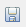

{width="6.527777777777778in" height="2.4618055555555554in"}

User manual part 4:

TaxEditor -- Advanced Tutorial

Version: 9 September 2021

**WORK IN PROGRESS**

# Contents {#contents .TOC-Heading}

[Contents [1](#_Toc82014145)](#_Toc82014145)

[1 Tutorial [2](#_Toc81140466)](#_Toc81140466)

[1.1 Tutorial: Adding a taxon in the *Taxon Navigator* [3](#tutorial-adding-a-taxon-in-the-taxon-navigator)](#tutorial-adding-a-taxon-in-the-taxon-navigator)

[1.1.1 Add a new name to *Lymanbensonia* Kimnach [3](#add-a-new-name-to-lymanbensonia-kimnach)](#add-a-new-name-to-lymanbensonia-kimnach)

[1.1.2 Adding a "sec. Reference " [3](#adding-a-sec.-reference)](#adding-a-sec.-reference)

[1.1.3 Adding details to the authors [3](#adding-details-to-the-authors)](#adding-details-to-the-authors)

[1.1.4 Check the nomenclatural reference citation [3](#check-the-nomenclatural-reference-citation)](#check-the-nomenclatural-reference-citation)

[1.1.5 Add a synonym and its reference citation [3](#add-a-synonym-and-its-reference-citation)](#add-a-synonym-and-its-reference-citation)

[1.1.6 Homotypic relationship [4](#homotypic-relationship)](#homotypic-relationship)

[1.1.7 Add the nomenclatural type [4](#add-the-nomenclatural-type)](#add-the-nomenclatural-type)

[1.1.8 Change the Classification -- add a tribe [4](#change-the-classification-add-a-tribe)](#change-the-classification-add-a-tribe)

[1.1.9 Change the status of a name [5](#change-the-status-of-a-name)](#change-the-status-of-a-name)

[1.2 Adapt the vocabulary of a selection list [5](#adapt-the-vocabulary-of-a-selection-list)](#adapt-the-vocabulary-of-a-selection-list)

[1.2.1 Adapting the language selection [5](#adapting-the-language-selection)](#adapting-the-language-selection)

[1.2.2 Adapting the options for the distribution status [6](#adapting-the-options-for-the-distribution-status)](#adapting-the-options-for-the-distribution-status)

[1.3 Add factual data [7](#add-factual-data)](#add-factual-data)

[1.4 Area distribution [7](#area-distribution)](#area-distribution)

[1.5 Images [8](#images)](#images)

[1.6 Specimen entry starting in the *Factual Data* view [8](#specimen-entry-starting-in-the-factual-data-view)](#specimen-entry-starting-in-the-factual-data-view)

[1.7 Identification Keys [10](#identification-keys)](#identification-keys)

[1.8 Images [10](#images-1)](#images-1)

[1.9 Bulk Editor [11](#bulk-editor)](#bulk-editor)

[1.9.1 Persons and Teams [11](#persons-and-teams)](#persons-and-teams)

[1.9.2 References [11](#references)](#references)

[1.10 Using the specimen (tree) *Bulk Editor* [11](#using-the-specimen-tree-bulk-editor)](#using-the-specimen-tree-bulk-editor)

[1.10.1 Adding a new specimen [12](#adding-a-new-specimen)](#adding-a-new-specimen)

[1.10.2 Associating a specimen with a taxon [12](#associating-a-specimen-with-a-taxon)](#associating-a-specimen-with-a-taxon)

[1.10.3 Editing existing specimens [13](#editing-existing-specimens)](#editing-existing-specimens)

[1.10.4 Adding media to specimens [13](#adding-media-to-specimens)](#adding-media-to-specimens)

[2 Advanced handling of specimen data -- Imports and the *Derivative Editor* [15](#advanced-handling-of-specimen-data-imports-and-the-derivative-editor)](#advanced-handling-of-specimen-data-imports-and-the-derivative-editor)

[2.1 Import of specimens via ABCD [15](#import-of-specimens-via-abcd)](#import-of-specimens-via-abcd)

[1.1 Working with the Specimen Tree Editor [15](#working-with-the-specimen-tree-editor)](#working-with-the-specimen-tree-editor)

[1.1.1 Specimen duplicate - deduplication [16](#specimen-duplicate---deduplication)](#specimen-duplicate---deduplication)

[1.1.2 Entering a specimen duplicate [16](#entering-a-specimen-duplicate)](#entering-a-specimen-duplicate)

[1.1.3 Input: specimen image, type image [16](#input-specimen-image-type-image)](#input-specimen-image-type-image)

[3 Sample data [17](#sample-data)](#sample-data)

[]{#_Toc81140466 .anchor}We are using the Caryophyllales Genera dataset to demonstrate the taxonomic workflow with the TaxEditor. Connect the Editor to a Caryophyllales_demo database and open the respective Data Portal (see part 2 of the manual). We will add the information from a taxonomic paper. An excerpt from the paper is found in section 11 of this document (Korotkova et al., 2010).

# *Taxon Navigator* and *Name Editor*

## Tutorial: Adding a taxon in the *Taxon Navigator*

### Add a new name to *Lymanbensonia* Kimnach

To add *L. incachancana* as a child taxon to the genus *Lymanbensonia*, go to the *Taxon Navigator,* select the genus, open the menu with a right click and choose -\> *New* -\> *Taxon*

Copy the entire name (including authors) from the paper to the field *New Taxon* and click *Finish*\
-\> a new taxon appears and the name will be automatically atomized.

{width="0.2701388888888889in" height="0.28055555555555556in"}This is a new combination in the present article, so add "in Willdenowia 40(2): 167. 2010" as the nomenclatural reference. Input may be a bit choppy as the program tries to parse it immediately.

Please also add the names of the other 3 species of *Lymanbensonia,* so that we have them available for the workshop: *L. brevispina, L. crenata* y *L. micrantha.*

### Adding a "sec. Reference "

{width="0.2701388888888889in" height="0.28055555555555556in"}Have a look at the *Details View* on the right. In the *Taxon* section, the "Secundum" is a reference that defines the circumscription of the taxon. In our case this is the same article we are working with. Look under *Browse existing* {width="0.21388888888888888in" height="0.20069444444444445in"} if the reference already exists. It does: Korotkova & al. (2010).

{width="0.2076388888888889in" height="0.20069444444444445in"}{width="0.21388888888888888in" height="0.20069444444444445in"}Look under *Edit* if the reference is correct. It is, but the reference record is not properly atomised. Don't worry about this now, we will have a look at references later.

### Adding details to the authors

Go to the *Name* section of the *Details*{width="2.1805555555555554in" height="0.5520833333333334in"} view and edit the authors.

{width="2.609027777777778in" height="1.3090277777777777in"}

Add the full names to the persons.

And finally save the Name Editor{width="0.2701388888888889in" height="0.28055555555555556in"}

### Check the nomenclatural reference citation

Check in the *Nomenclatural Reference* section in the *Details View* if the reference is atomized correctly.

### Add a synonym and its reference citation 

In the *Name Editor* window, enter a carriage return right after the full name and citation of the taxon.\
Copy the basionym *Rhipsalis incachacana* including its Author and nomenclatural citation from the paper to the new line in the *Name Editor*.

**(Note**: For the time being you need to click on the accepted taxon name line and back again on the newly added synonym to make the data appear in the *Details View*. (This problem will be fixed in future versions of the application)

For some reason the reference title cannot be parsed. Go to the *Nomenclatural Reference* section in the *Details View*. Set the reference type to *Article* and atomize the reference citation string by transferring the details into the appropriate fields.

### Homotypic relationship

The synonym is the basionym of the correct name. In the *Name Editor* window, grab the synonym and drag it onto the correct name. The symbol now indicates the homotypic relationship of the two names.

Right click on the basionym and select *Set as basionym for this homotypic group*.[^1]

### Add the nomenclatural type

Go to the *Type Designations* section of the *Details View*. Press the + sign to the right of the *Nomenclatural Type* heading. The editor form to enter a type designation will be added to the *Type Designations* section. For species and infraspecific ranks, this form will be for a specimen type-designation, for supraspecific ranks a name type designation for will be presented.

{width="3.214583333333333in" height="0.7152777777777778in"}Set the *Designation Status* (in our case Holotype) and Cclick the folder icon to open the *Unit Selection Dialog* and press the *New Unit* button to create new specimen. Add the specimen information from the paper in the Title Cache field (for now we do not atomize the data, atomization will be done later. Input only the holotype).

### Change the Classification -- add a tribe

In the Paper, Korotkova & al. describe a new Tribe, *Lymanbensonieae.*

Add this tribe under *Cactaceae* (best to copy from here):\
*Lymanbensonieae* N.Korotkova & Barthlott in Willdenowia 40(2): 166. 2010

Add the (invalid) synonym *Calymanthieae* from the paper (go to the *Nomenclatural Status* section of the *Detail* view to add the status).

In the *Taxon Navigator*, grab the genus *Calymmanthium* and drag it onto *Lymanbensonieae*. Do the same for *Lymanbensonia.*

{width="2.7625in" height="2.026388888888889in"}Instead of dragging the taxon node (which can be a bit cumbersome at long distances) you can choose Move taxon (with child taxa) from the context menu. A selection dialog will be shown in which you can select the new parent taxon node. Type the name of the parent to limit the list of choisestaxon names.

### Change the status of a name

Let's assume that we have concluded that L. incachacana is actually a synonym of L. micrantha.

Right click on L. incachacana in the Taxon Navigator. Select Change accepted taxon to synonym and select the accepted name.

## Adapt the vocabulary of a selection list

### Adapting the language selection

Use the *Taxon Navigator* to go to *Caryophyllaceae* and *Arenaria* , open the *Name Editor* by double click on the Name and try to add a common name\
Right click on *Taxon dDescription for ...* in the *Factual Data* view and choose *New -\> Common Name*

In the *Details View* click on the Language. The system provides a large number of languages! Normally only a handful is really needed.

\[In the *Details View* you could also add a media file to produce the pronunciation if you had it. This may come in handy in an ethnobotanical context, same as the possibility to define the geographical area where this name is used.\]

To restrict the number of languages shown, go to the main menu bar *Windows* -\> *Local* *Preferences -\> Language -\> Available Languages*. By default the default settings are active. Click on the selection button below the list and choose *Use local settings* to enable the checkboxes for editing. Now choose your language preferences, for example Spanish, English, German, French.

{width="3.279861111111111in" height="2.829861111111111in"}

Go back to the common names and add for example Spanish "arenaria", English "sandwort", German "Sandkr äuter", French "sablines".

### Adapting the options for the distribution status

To restrict the number of options for the occurrence status (e.g. in the *Distribution editor*), go to the menu *Admin* -\> *Server-sided* *Preferences* *-\> UI -\> Distribution Data -\> Status* and click Status Selection to open the Dialog which allows for defining the selection of status for all or for specific areas. {width="5.602362204724409in" height="3.34251968503937in"}

## Add factual data

Use again the paper about *Lymanbensonia* to copy and paste factual data from the paper.

Open the genus *Lymanbensonia* in the *Name Editor*. Look at the *Factual Data* window. The genus already has a factual dataset (*"Taxon Description for ..."*) containing the notes given in the publication, so we don't need to add a new one. In situations when the *Factual Data* view for a taxon is empty you would need to create a taxon description by choosing *New Factual Data Set* in the context menu of the *Factual Data* view. Another right click on the newly created Taxon description reveals the option to create a *Description* fact set: *New-\>Description* (the latter here meaning the actual textual description of the genus). *.*Toggle the *Description* fFeature set open. There and check if there is already an empty data set with the label "No text provided". Empty data sets are usually created when the Feature is created. Otherwise rand create a new data set by choosing

Copy and paste the description text from the article into the text field in the *Details View*.

Add Korotkova & al. 2010 as Reference in the *Sources* section. Click the Plus icon {width="0.2916666666666667in" height="0.25in"} to add a new source and add Korotkova & al. 2010 by selecting it as Reference in the selection Dialog for the fielsd *Reference*..

Proceed to add the *Distribution (General)*, *Etymology* and the *key* from the paper using the same workflow.

Have a look at the data in your data portal. You can use HTML formatting in the free texts: for example, if you start a species name in the key with \<i\> and end it with \</i\>, it will show up as italics in the portal.

## Area distribution

Distribution by geographical areas is based on catalogues that may be created and maintained in the *Term Editor* (see section 6.1).

Area input is either handled through the *Checklist editor* (see chapter below) or, one by one, in the *Factual Data* window of the *Name Editor*, as follows:

Right click on *Taxon Description for ...* in the *Factual Data* view*: New -\> Distribution (Area)*

Toggle the new fFeature set *Distribution (Area)* open and select the newly created entry with the label "*EMPTY*". In the *Details View* open the selection dialog for the area.\
*Lymanbensonia* is native in Peru and Bolivia according to the following article:\
Ibisch P. L., Kessler M., Nowicki S. & Barthlott W. 2000:  Ecology, biogeography and diversity of the Bolivian epiphytic cacti, with the description of two new taxa. -- Bradleya 18:   2 -- 30.

For variety, we'll also add that it is cultivated in Mexico.

{width="2.9652777777777777in" height="1.7847222222222223in"}Have a look at the map in the *Details View* when you click on *Distribution (areas)* in the *Factual Data* window. A similar map should also be visible in the Portal.

In the selection dialogue, you can also choose the catalogue used for area distributions. Click on the funnel icon. A selection of area catalogues is displayed, you can choose one or more catalogues to be available in the search.

## Images

Images are not stored directly in the CDM, so they have to be available under an Internet address (URL) to become part of CDM data. Since images can be attached to a number of database objects (Taxa, Specimens, morphological characters, etc.), they are handled differently.

To add an image to a taxon, first open the respective taxon in the *Name Editor* window. Next you go to the menu, *Windows -\> Show View -\> Media.* This opens the *Media* view. Select the taxon and right click on the empty space within the Media view -\> *New Image Gallery.*

Select the *empty media* item and add your data in the *Details View*.

For example, you can add images from flickr: [[https://www.flickr.com/search/?text=Lymanbensonia]{.underline}](https://www.flickr.com/search/?text=Lymanbensonia)\
Copy the URL of the flickr image to the *URL* field in the *Details View*, and the image's metadata in the other respective fields. This may not work if you are not a Flickr member.

Alternatively, try one of the the following URLs:

-   \[Dianthus deltoides, Berlin, Germany, W.-H. Kusber, CC-BY-SA\] [[http://media.bgbm.org/erez/erez?cmd=get&src=specimentool/plants/dicots/Dianthus_deltoides_2014-09-21_whk_DE_Rehwiese_P1060030.JPG]{.underline}](http://media.bgbm.org/erez/erez?cmd=get&src=specimentool/plants/dicots/Dianthus_deltoides_2014-09-21_whk_DE_Rehwiese_P1060030.JPG)

\[Lepismium houlletianum Source: self-made Date: created 14. Sep. 2007 Author: Frank Vincentz Licensing: GFDL (self made) \] <https://upload.wikimedia.org/wikipedia/commons/c/c6/Lepismium_houlletianum_2_ies.jpg>

## Specimen entry starting in the *Factual Data* view

We want to enter the following specimen for *Lymanbensonia crenata*:

Bolivia, La Paz, Prov. Sud Yungas, 39 de La Plazuela a La Paz, 16 °38'S, 67°34'W, 2300m, 22.9.1995, *Kessler 5663* (LPB)*.*

{width="2.2597222222222224in" height="3.1395833333333334in"}We will enter the specimen as feature of the type Specimen. In order to enter the specimens as structured data we need to prepare the Feature Specimen to accept atomized data (see also chapter below). Open the *Feature Editor* via the main menu *-\> Window -\> Terms -\> Feature* and select Specimen in the list. The *Details View* now reveals the choices to define the supported data types. Click *Supports Individual Association* to enable this data type and save the editor (Ctrl + s).

{width="3.0256944444444445in" height="4.2659722222222225in"}Open *Lymanbensonia crenata* in the *Name Editor.*

Right click on *Factual data set for ..*[^2] in the *Factual Data* view *-\> New -\> Specimen.* Toggle open the feature set *Specimen* and select the newly created entry *No unit chosen.*

In the *Details View* click on the *Browse existing* button for *Occurrence/Unit.*

Enter the asterisk'\*' character to check if the specimen has already been entered.

If not, choose *New Field Unit/Derived Unit* below*.* Enter the atomised data as depicted.

If you copy the Latitude / Longitude fields from a text using geographical (NSEW-) coordinates, for the time being please pay attention that you get the straight quotes for minutes and seconds (not: ' and ").

You probably have to enter a new person for the *Collector* (just use the *Title Cache* field in this case) and a new *Collection* (use the *Code* field).

## Identification Keys

We had already introduced a key to the species of Lymanbensonia by simply copying and pasting the entire text of the key into a database field. This is of course is a very unsophisticated way to proceed. The platform provides another possibility to enter and display keys.

Close your *Name Editor* and *Media* views.

{width="3.247916666666667in" height="1.8916666666666666in"}In the menu, use *Window -\> ShowView -\> Polytomous Keys* to open the respective view. All such semi-structured keys that have been created in the database will be listed (none as yet).

Right click in the empty area of the View *-\> New.* Enter the Title as "Key to the species of Lymanbensonia" and select Lymanbensonia as the *Taxonomic Scope* and click Fininsh to return to the *Polytomous Keys* view and double click the new key entry to open the Key Editor.

*.*

\[For now the *Details View* is blank and the key data like scopes cannot be edited until the first entry is added to the key.\] In the Key Editor view do a right click and choose *New Key Number -\> Before the Current Node* to add the first entry. You can now sequentially add the statements and their alternatives; the leads will be added automatically in this case.

If the key indexes are messed up you can use *Refresh* from the context menu to recalculate them.

Have a look at your new key in the data portal.

## Images

Images are not stored directly in the CDM database, so they have to be available under an Internet address (URI) to become part of CDM data. Since images can be attached to a number of database objects (Taxa, Specimens, morphological characters, etc.), they are handled in different ways.

To add an image to a taxon, first open the respective taxon in the *Name Editor* window. Next you go to the menu, *Windows -\> Show View -\> Media.* This opens the *Media* view. Select the taxon name and right click on the empty space within the Media view -\> *New Image Gallery.*

Select the *empty media* item and add your data in the *Details View*.

For example, you can add images from flickr: [[https://www.flickr.com/search/?text=Lymanbensonia]{.underline}](https://www.flickr.com/search/?text=Lymanbensonia)\
Copy the URL of the flickr image to the *URL* field in the *Details View*, and the image's metadata in the other respective fields. This may not work if you are not a Flickr member.

Alternatively, try one of the the following URLs:

-   \[Dianthus deltoides, Berlin, Germany, W.-H. Kusber, CC-BY-SA\] [[http://media.bgbm.org/erez/erez?cmd=get&src=specimentool/plants/dicots/Dianthus_deltoides_2014-09-21_whk_DE_Rehwiese_P1060030.JPG]{.underline}](http://media.bgbm.org/erez/erez?cmd=get&src=specimentool/plants/dicots/Dianthus_deltoides_2014-09-21_whk_DE_Rehwiese_P1060030.JPG)

\[Lepismium houlletianum Source: self-made Date: created 14. Sep. 2007 Author: Frank Vincentz Licensing: GFDL (self made) \] <https://upload.wikimedia.org/wikipedia/commons/c/c6/Lepismium_houlletianum_2_ies.jpg>

## Bulk Editor

### Persons and Teams

We will try to sort out some of the authors and teams in the Caryophyllales database.

Go to *Window -\> Bulk Editor -\> Persons and Teams,* enter "D\*" and search

Right click on any record, -\> *Open in* -\> *Referencing Objects View.* In the *Referencing Objects* view you can see where and in which context the respective person name or team has been used.

Deduplication: "D.Don" is repeated in the database. Look at the two records in the *Details* and *Referenzing Objects* views. Mark the second record as *target for deduplication* and the other one as *candidate for deduplication* and click *deduplicate group*. Watch the result in the *Referencing Objects*{width="3.5902777777777777in" height="1.0173611111111112in"} view.

You can go ahead and deduplicate those entries were a single person exists as person and as team.

Editorial scrutiny: Look at the Dinter & Berger / A.Berger Team. Is it correct that these are two different Bergers? (Tropicos, IPNI). If not, search for the referenced name (type of *Hereroa*) and correct the authors.

### References

Open the *Reference Bulk Editor* and search for "\*Mex\*"

There are 2 duplicate entries and two articles which are not properly atomised. Try to clean up this mess.

## Using the specimen (tree) *Bulk Editor* 

The TaxEditor has two different Bulk Editors for specimens and occurrences. The *Specimen (list) Editor* presents them in a flat list. The ***Specimen (tree)** Editor*, in contrast, shows the derivation hierarchy of the items, that is, a list of derivation trees which are initially collapsed. An item of the type *Field Unit* is the root of each derivation tree.

Go to the bulk editor for specimen and observations: *Window -\> Bulk Editor -\> Specimen Editor (tree)*

### Adding a new specimen

When starting from scratch, you need to create the Field Unit for the specimen first. The Field Unit contains all information related to the collection or observation event, like the collector, collecting date, field number, locality, etc. Specimens are handled as derivatives that stem from that initial event.

To create a new Field Unit, right click in the specimen (tree) content area and select *Create Field Unit*

{width="5.515748031496063in" height="2.0354330708661417in"}

A new Field Unit with a cryptic title has been created. The title will be updated to a more meaningful text string while entering the corresponding data in the Details Editor.

{width="3.3020833333333335in" height="1.6180555555555556in"}Now select the Field Unit and choose *Add ... \> Specimen* via the context menu to create a specimen.\
Enter the details in the right pane and save the editor by *Ctrl + s*.

###  Associating a specimen with a taxon

This needs to be done via the *Factual Data Editor*, see above.

### Editing existing specimens

{width="2.479861111111111in" height="4.35in"}Search for all specimen with by entering "\*" into the *Title Cache* field of the search bar. You should see the type specimens you entered before (section 4.3.7 ).

In this view you can create a new Click on one of the specimen and go to the *Details View* and fill the details like in the screenshot.

In the *Details View* you will see available (empty) atomised data items for the specimen.

The *Title Cache* field contains some of these data. Copy and paste them into the correct fields.

> Note: Do not click the lock icon of the title cache field before you are finished. Doing so would set the *Title Cache* to be automatically generated from the individual atomic fields.
>
> When you are done click the lock icon of the *Title Cache* field.

There are a number of additional specimen data items that can be added here. However, this is still the simplified view of specimen data. The full scope of a specimen can be seen and edited in the specimen tree Editor which is explained in section 9.4

### Adding media to specimens

Media of specimens, like for example scans, or photos, are treated as derivative of the physical specimens and are therefore specimens themselves.

{width="2.979861111111111in" height="1.3930555555555555in"}It is possible to add an existing or new media to a specimen. Select the specimen in the derivation tree for which a media specimen is to be added and open the context menu (*right click*). The option *Add \... \> Media \> Media Specimen* will cause a new Media Specimen to be added to the selected item. Details of the Media item are all blank and can be filled.

The *Existing Media* option in contrast will first open a selection dialog by which an existing media item can be chosen. After confirming the selection a new Media Specimen is added to the physical specimen item and the media details are immediately filled. In this case the same Media object is actually being reused and shared by multiple referencing objects. Hence, modification of the media details will affect all contexts in which it is being used.

For working with media in general, please refer to paragraph 10.

#  Advanced handling of specimen data -- Imports and the *Derivative Editor*

## Import of specimens via ABCD

ABCD (Access to Biological Collection Data) is TDWG standard. It is an XML schema defining data items used to describe specimens, field observations of species, and collections. It is largely compatible with but more extensive than the Darwin Core data standard with its various extensions.

Open the *Import* interface in the menu under *General-\> Import-\> ABCD.*

On the second page (Xml File) select the file *Arenaria_ABCD_one_unit.xml* and -\> *Finish.*

Under *Configure import destinations* leave the classification chooser empty (i.e. do nothing; a default classification will be created). -\> *Next*

Under *Import configuration* check *Import Media as media specimen* and *Map UnitID to accession number* in addition to the already checked options. -\> *Next*

Leave the botanical code as selected on the next page. -\> *Finish*

Under *Configure import destinations* leave the classification chooser empty (i.e. do nothing; a default classification will be created). -\> *Next*

Let the Import routine do its work, it may take some time. In the end it will show you a report detailing what has happened (and if it has detected problems).

Look at the taxon navigator for the classification and the taxa created from the import. \[Currently you need to close and reopen the taxon navigator to update its content.\]

Open *Arenaria* *serpyllifolia* L. subsp. *serpyllifolia* and have look at the Factual Data view. You will see the recently imported specimen attached to this taxon. \[Due to a technical problem this won't work at the time being.\]

Now, if you search for'\*\' in the *Specimen Editor (tree)* you should also find the recently imported specimen. Note: The Search can be filtered. Searching for'\*Rheinland\*\' for example will only retrieve the imported specimen.

## Working with the Specimen Tree Editor

Open the *Derivative Editor: Window-\>Bulk Editor-\>Specimen Editor (tree).*

The top panel allows you to search specimens. The Title Cache corresponds to the specimen citation, don't worry about the other items. Just enter \* to see all specimens.

The derivative hierarchy of the specimen will be shown:

-   The *FieldUnit* containing information about the collector and the gathering

-   The *PreservedSpecimen* itself.

-   A *Specimen scan* is visible because the link was part of the imported ABCD file (a preview is generated on-the-fly) . \[Due to a technical problem this won't work at the time being.\]

Select the specimen scan in the hierarchy and have a look - the *Details View* will load a preview of the specimen scan.

### Specimen duplicate - deduplication

We will import the same specimen (Hand 6047) again and pretend that it is an imported duplicate:

Select the specimen in the hierarchy and change the Collection to MEXU and the accession number to PV1234567. -\>*Save*

Repeat the import with the same file but uncheck the option "*Do not import existing specimens"* in the *Configure Import parameters dialog* (see above) also not check „*Add media as media specimen*".

Note: In the report you can see that no taxon or name was created but only the specimen.

In the derivative hierarchy you will see two field units with the same title, each with a specimen.

Drag the one of the specimens to the other field unit.

Right-Click on the empty *Field Unit* -\> *Delete*. Now we have only one field unit with two duplicate specimen.

### Entering a specimen duplicate

Remember that in the Weberbauer 1353 specimen citation we did not enter the information that the holotype was a specimen in Berlin?

Right click on the respective *Field Unit -\> New -\> Specimen*. Enter B as the collection and assign the specimen it to *L. incachancana* as the holotype. Don't worry about the "destroyed" for the time being.

### Input: specimen image, type image

The specimen image needs to be accessible via an URI (i.e., it must be on the WWW if you want it to be available to the outside). The image can be added as a derivative of the respective specimen.

# Sample data

**A phylogenetic analysis of *Pfeiffera* and the reinstatement of *Lymanbensonia* as an independently evolved lineage of epiphytic *Cactaceae* within a new tribe *Lymanbensonieae***

Nadja Korotkova, Leonie Zabel, Dietmar Quandt, Wilhelm Barthlott

\....

**New circumscriptions and descriptions of *Pfeiffera* (*Echinocereeae*) and *Lymanbensonia* (*Lymanbensonieae*), keys to their species, new names and combinations**

**\....**

***Lymanbensonieae* N. Korotkova & Barthlott, nom. nov.**

*=* *Calymanthieae* Lakomski in Swiat Kakt. 38(1-2): 66. 2003, **nom. inval.,** without Latin diagnosis (ICBN Art. 36.1).

*Diagnosis*. --- Plantae aut epiphyticae pendulae caulibus foliaceis vel terrestres erectae caulibus ascendentibus (*Lymanbensonia*) aut plantae fruticosae erectae caulibus columnaribus usque ad 8 m altae (*Calymmanthium*). Flores rubro-roseae vel albae, pericarpelli non spinosi. Habitat in Bolivia et Peru usque ad Equadoriam australem.

*Description*. --- Plants epiphytic, pendent with leaf-like flattened stems or terrestrial, erect (*Lymanbensonia*) or shrubby, erect columnar plants up to 8 meters high (*Calymmanthium*). Flowers mostly pink to red or white, pericarpels not spiny. Occurring in Bolivia, Peru, extending to southern Ecuador.

*Members*. --- *Calymmanthium* F.Ritter (1 sp.), *Lymanbensonia* Kimnach (4 spp.).

***Lymanbensonia* Kimnach**

in Cact. Succ. J. (Los Angeles) 56(3): 101 1984.

Type species: *Cereus micranthus* Vaupel, Bot. Jahrb. Syst. 50: Beibl. 111: 19. 1913.

Generic synonym: *Acanthorhipsalis* sensu Kimnach in Cact. Succ. J. (Los Angeles) 55:179. 1983, **nom. illeg.**

Accepted species: 4

*Note. ---* In his revision of *Acanthorhipsalis* Kimnach (1983) excluded all species from the genus but *A. micrantha*. Noticing that by excluding the type species *A. monacantha*, he had created an illegitimate homonym, he afterwards proposed a new genus *Lymanbensonia* for *A. micrantha* (Kimnach 1984).

*Etymology*. --- Named after Lyman Benson (1903-1993), American botanist.

*Description*. --- *Life-form* predominantly terrestrial or epiphytic, epiphytic habit obligatory or facultative. Plants usually erect at first, then spreading, pendent. *Adventitious roots* lacking. *Branching* mesotonic, *Stems* of indeterminate growth, old stem-segments not deciduous, stems flattened, angled at first in *L. micrantha*. *Branch segments* narrowly-oblong (broadly-oblong in *L. incachacana*); cladode-margins crenate or crenulate. *Areoles* superficial (sunken in *L. incachacana*), composite terminal areoles absent, bristles and trichomes often present. *Spines* usually well developed with 1 --10 yellowish whitish or grey spines per areole. *Pericarpel* +/- sharply differentiated from perianth, not tuberculate (= smooth);

terete or cup-shaped, not conspicuously angled, not spiny. *Flowers* usually solitary, rarely 2 per areole, lateral, actinomorphic, 1.2 to 3 cm long, narrowly tubular bell-shaped, tepals not fully expanding, spreading at apices perianth intensely coloured (red, pink, orange, magenta) or white in *L. brevispina*. *Hypanthium* (receptacle-tube) not conspicuously developed, except in *L. micrantha. Stamens* ca. 20 --50, filaments and anthers white or whitish/cream, *Fruits* globose or subglobose, coloured (red-brown, white to pinkish, greenish) opaque, naked. *Funiculi* simple, with short stalk (examined so far only in *L. micrantha*).

*Distribution and habitat*. ---Ranges from Southern Ecuador (Loja) to central and southern Peru (Amazonas, Junín, Puno) and the eastern Andes of Bolivia (La Paz; Cochabamba, Santa Cruz).

**Key to the species of *Lymanbensonia***

1 Flower-bearing areoles and pericarpel deeply sunken into the stem, areoles with dense tufts of bristles and wool 3. *L. incachacana*

-- Flower-bearing areoles not deeply sunken, areoles not densely woolly 2

2 flowers white 1. *L. brevispina*

-- flowers coloured (orange, pink, magenta) 3

3 Flowers 3 --4 cm long, receptacle-tube well developed 4. *L. micrantha*

-- Flowers smaller, receptacle-tube not developed 2. *L. crenata*

**1. *Lymanbensonia brevispina ***(D.R. Hunt) Barthlott & N. Korotkova, **comb. nov.**

Basionym ≡ *Pfeiffera brevispina* D.R. Hunt in Cactaceae Syst. Init. 14: 18. 2002.

Holotype: Peru, Amazonas, east of Balsas, *Ritter 1419* (U) as *Acanthorhipsalis brevispina* F.Ritter Kakteen S üdamerika 4: 1260. 1981. Syntype: F.Ritter, Kakteen S üdamerika 4: 1529, Fig. 1114, designated by Barthlott in Bradleya 5: 99. 1987 as *Lepismium brevispinum*.

*= Rhipsalis riocampanensis* Madsen & Z. Aguirre in Nordic J. Bot. 23(1): 26-29. 2004.

**2. *Lymanbensonia crenata ***(Britton) Doweld in Sukkulenty 4(1-2): 34, 2001 publ. 2002.

≡ *Hariota crenata* Britton in Bull. Torrey Bot. Club xviii. 35. 1891. Holotype: Bolivia, La Paz, Yungas, 1885, *Rusby 2047* (US).

**3. *Lymanbensonia incachacana ***(C árdenas) Barthlott & N. Korotkova, **comb. nov.**

≡ *Rhipsalis incachacana* C árdenas in Cactus (Paris) No. 34, 125. 1952. Holotype: Bolivia, Cochabamba, Incachaca, *C árdenas 4855*, June 1950 (LIL 511565).

**4. *Lymanbensonia micrantha*** (Vaupel) Kimnach in Cact. Succ. J. (Los Angeles) 56(3): 101. 1984. ≡ *Cereus micranthus* Vaupel in Bot. Jahrb. Syst. 50: Beibl. 111: 19. 1913. Holotype: Peru, Puno, near Sand ía, 31. July 1902, *Weberbauer 1353* (B, destroyed), isotype: US.

**\.....**

[^1]: The interface also allows the direct handling of replaced synonyms and nomina nova in the homotypic group via the *Nomenclatural Status* section of the Details-View.

[^2]: If you don't see a *TaxonFactual data set for ...* entry, add a new factual dataset by right clicking in the empty area of the *Factual Data* window and choose *New Factual Data Set*).
