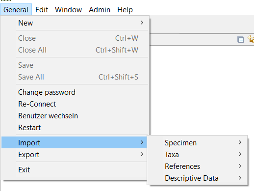
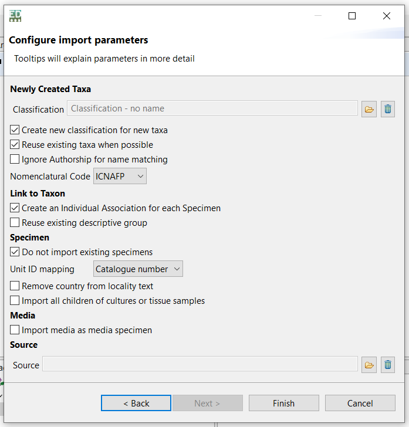
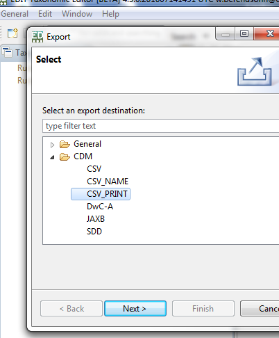
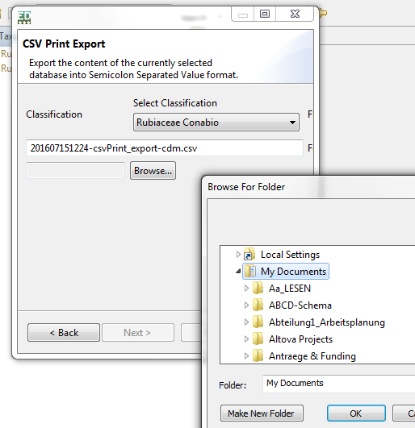
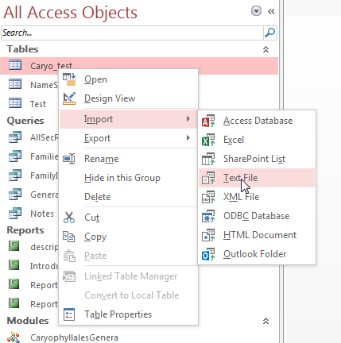
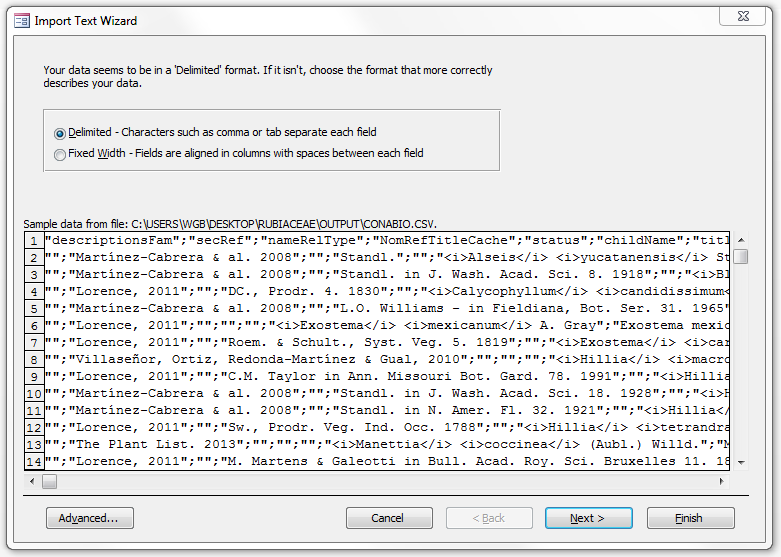
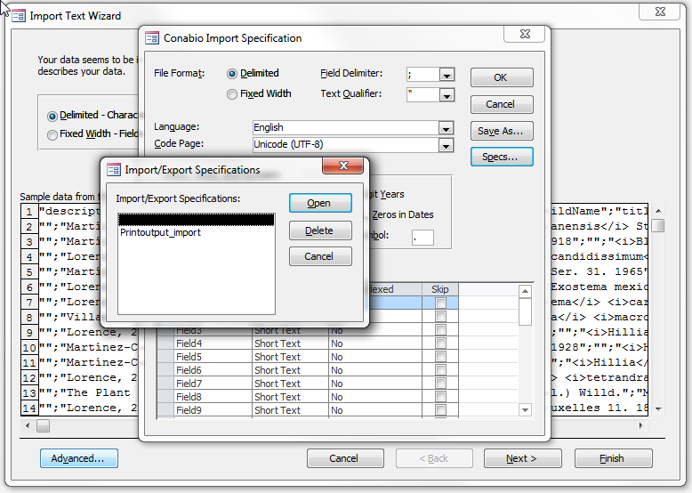
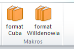

{width="6.527777777777778in" height="2.4618055555555554in"}

User manual part 6:

TaxEditor: Importing and Exporting Data

Version: 8 September 2021

WORK IN PROGRESS

Contents

[1 Importing data [2](#importing-data)](#importing-data)

[1.1 S pecimens [2](#s-pecimens)](#s-pecimens)

[1.1.1 Importing specimens from GBIF [2](#importing-specimens-from-gbif)](#importing-specimens-from-gbif)

[1.1.2 Importing specimens from a BioCASe provider [2](#importing-specimens-from-a-biocase-provider)](#importing-specimens-from-a-biocase-provider)

[1.1.3 Importing an ABCD file [2](#importing-an-abcd-file)](#importing-an-abcd-file)

[2 Data export [4](#references)](#references)

[2.1 CDM-Light [4](#cdm-light)](#cdm-light)

# Importing data

{width="4.316666666666666in" height="3.2416666666666667in"}The import functionality of the TaxEditor is accessed via the menu -- *General -\> Import,* with the general options *Specimen, Taxa, References,* and *Descriptive Data*.

However, the import functionality is also available via the context menu of a Taxon in the *Taxon Navigator.*

## S pecimens

### Importing specimens from GBIF

Work in progress

### Importing specimens from a BioCASe provider

This is the standard way to import ABCD-formatted data from the menu *General-\>Import-\>Specimen-\>Specimen online*). To configure the data access, you need to ascertain the BioCASe provider access point. This is a URI, for example \[see <https://www.gbif.org/installation/2f369909-39c3-4eb7-946a-9155f2ffafca>\]. For a list of freely available providers see \*\*\*. You can also access these via GBIF: \...

### Importing an ABCD file

ABCD (Access to Biological Collection Data) is standard recognised by the Organisation for Biodiversity Information Standards "TDWG" (formerly known as "Taxonomic Databases Working Group"). It is an XML schema defining data items used to describe specimens, field observations of species, and collections. It is largely compatible with but more extensive than the Darwin Core data standard with its various extensions.

An ABCD file can be created by the adminstrator of a collection database, if that database is accessible via the BioCASe protocol.

To import the file, select the menu option *Import -\> ABCD-File*

In the first step, you select a Classification -- this defines the target taxon nodes for those specimens in the ABCD file that can be assigned to an existing taxon via their scientific name in the ABCD file.

In the next step, you select your ABCD-file and you can set a default source reference for all specimens in the import (this is text-only). \*\*Das scheint nicht zu funktionieren -- ist wohl immer "ABCD Classic"\*\*

The dialog that opens next offers several options for the handling of data during the import process:

{width="5.808836395450569in" height="6.067192694663167in"}

The options are further explained in tooltips (a text which appears when the mouse cursor is positioned over the option's prompt).

The Import routine may take some time. When finished, it will show a report detailing what has happened (and if it has detected problems).

If a new classification was created during the import process, this will show in the Taxon Navigator (Currently you have to close and reopen the taxon navigator to update its content.\]

The imported specimens can be seen in the factual data view of the taxon, or in the *Bulk* *Editor* for specimens.

## References

**From:** Korotkova, Nadja\
**Sent:** 02 September 2021 21:52\
**To:** Berendsohn, Walter \<W.Berendsohn@bgbm.org\>\
**Subject:** Re: RIS Import

generell sehr gut, allerdings werden noch nicht alle Tags importiert, bei Büchern, glaube ich, der Verlag. Und das Jahr wird nur importiert wenn es mit DA -- getaggt ist und nicht mit PY  --. EndNote exportiert das Jahr allerdings mit PY -- Da ich das weiß, achte ich drauf. Ich vergesse immer, Andreas das mal zu schreiben.

Nur bei Book Chapters funktioniert der Import nur teilweise, dafür muss man ja das Buch separat anlegen und dann das Chapter. Aber für normale Bücher und Journals funktioniert der Import problemlos und man muss vor allem keine Teams manuell anlegen, die werden korrekt importiert.

# Data export

## CDM-Light 

\[Export of EDIT-CDM data content:

The most straight-forward and comprehensive (though still not complete!) export functionality is the "CDM-light " Export. This creates a number of tables, that can be related by the contained IDs (e.g. the Synonyms with their accepted names, the taxa and synonyms with their names, etc.). This is best done in tools like MS-Access.

You can access the Export directly from the menu: General-\>Export-\>CDM-light (csv). However, you will rarely really want to export everything (and in some cases this still may lead to a server-timeout for larger datasets requested on network connections).

So it is better to use the Export from the "Taxon navigator " window (the taxonomic tree normally located to the right in the TaxEditor). In the taxonomic tree, right-click on the taxon you want, choose Export and CDM-light. This will export only the subtree, e.g. if you choose a family, all the genera, species etc. in the family you choo se including their synonyms and simple factual data will be exported. You can choose if you want to compress the resulting csv-files for delivery in a .zip-file, or if they should come individually.

For now, see [[https://dev.e-taxonomy.eu/trac/wiki/PrintPublisherDev]{.underline}](https://dev.e-taxonomy.eu/trac/wiki/PrintPublisherDev) for further steps.\
\
\
\
\
\
You can use this procedure (CDM-2-Word) either to directly check your database content in a document environment, or you can use it to compare the current content to an earlier version (e.g. the state of content before and after your or another person's input). In the following you'll find the steps to generate a Word file from the database, and subsequently how you can use Word to compare different versions of your output.

You can download the necessary tools under [[http://cybertaxonomy.eu/download/platform/Output.zip]{.underline}](http://cybertaxonomy.eu/download/platform/Output.zip)

**1^st^ Step: Export from the EDIT Platform database using the TaxEditor:**

{width="2.667361111111111in" height="3.2243055555555555in"}In the menu, select *General -- Export -- CDM -- CSV_PRINT* and *Next.*

-   Select the classification you want to export \[ready in Editor v. 4.3\]

-   {width="2.8333333333333335in" height="2.9277777777777776in"}Leave the filename of the csv-file as it is and save the file in your project folder under My Documents.

**2^nd^ Step: Processing the data in Access:**

-   Open the Access database "CDM2Word.accdb".

Right-click on the table name and choose Import -- Text File

-   Select the csv-file from your project folder

## Export to the EDIT-Platform Output Model

Specs for Author string in FullNameWithAuthors (Tropicos Format)

F ür jeden Einzelautor bei Klammer- und Kombinations-Autorenteams plus jeweils ex-Autorenteams

-   Initialen mit Punkten

-   Initialen ohne Leerzeichen gereiht und dann vor dem Nachnamen bzw. der Nachnamenabk ürzung ein Leerzeichen

-   der Suffix „f." (für filius) mit Leerzeichen davor. Also Hook. f. -- nicht Hook.f. wie in IPNI.

Bei der Teambildung

-   Die Standardabk ürzungen hintereinander ausgegeben, also ohne Ver änderung des Standards

-   Liste  mit Komma dazwischen bzw. zwischen den letzten beiden mit „&".

-   Beim Datenbankoutput über die Name-Check Funktion gibt's meiner Ansicht nach keine Begrenzung der Anzahl der Autoren.

```{=html}
<!-- -->
```
-   {width="2.6993055555555556in" height="2.71875in"}Select Import *the source data into a new table in the current database* and click on *OK*

    -   {width="3.7680555555555557in" height="2.6868055555555554in"}In the next screen, click on *Advanced \...*


-   {width="3.702777777777778in" height="2.6368055555555556in"}Click on *Specs \...* and select the predefined import specification *Printoutput_import -\> Open.*

-   If there is an error message, ignore it.

-   The data from the database are now in Access.

```{=html}
<!-- -->
```
-   Right click on the *Report* *CaryophyllalesSpecies* and choose *Export -- Text* and choose a name and directory. This concludes the processing in Access, you can close Access now.

> **3rd Step: Final processing in Word**
>
> Open the file created in the previous step in Word.

If the word template is correctly loaded there should be two new buttons in your menu bar:

{width="1.5208333333333333in" height="1.0208333333333333in"}

If you want to format your output in willdenowia format, click on format willdenowia, or if you want to format it more like the publication of the cuba checklist then choose format Cuba.
