---
title: "The CDM Dataportal Configuration manual"
subtitle: "Version: 13 May 2020"
author: [Walter Berendsohn, Andreas Kohlbecker]
subject: "EDIT Platform user manual 4"
keywords: [EDIT Platform, TaxEditor]
lang: "en"
linkcolor: blue
citecolor: blue
urlcolor: blue
toccolor: black
titlepage: true
titlepage-text-color: "FFFFFF"
titlepage-rule-color: "FFFFFF"
titlepage-rule-height: 0
titlepage-background: "../layout/Titel-A4.png"
toc-own-page: true
mainfont: "Arial Unicode MS"
header-includes:
- \usepackage{wrapfig}
- |
    \usepackage[export]{adjustbox}
    \let\includegraphicsbak\includegraphics
    \renewcommand*{\includegraphics}[2][]{\includegraphicsbak[frame,#1]{#2}}
...

work-in-progress, includes notes taken from emails etc.

\newpage

\[These are notes taken during the configuration of portals -- more complete albeit more technical instructions can be found in the Drupal site itself\]

# Working with Drupal

## Passwords

### I lost my password, how can I reset it?

You can reset the passwords via these links here

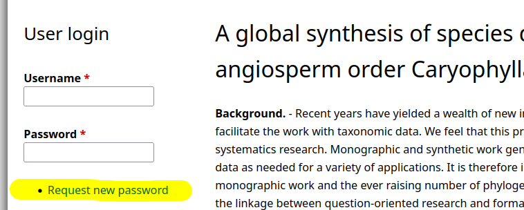

to reset them. The "request new password" is available in every portal.

## Introduction

An brief overview of menu functions is given in the "Drupal for dummies cheat sheet": [http://www.dummies.com/web-design-development/site-development/drupal-for-dummies-cheat-sheet/](http://www.dummies.com/web-design-development/site-development/drupal-for-dummies-cheat-sheet/).

If you don't find a Login on the home page, use use \[siteURL\]/user/login to enable editing and administration. .

## Managing pages

### Setting the homepage for the Data Portal

Open the  "*Configuration > System > Site information*" via the admin menu which sits at the top of the Data Portal pages when you are logged in.

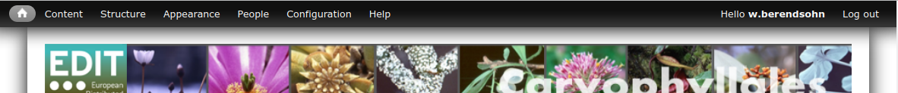

Find the "*Default front page*" field in "*Site information*"" settings page:

Enter the [URL alias](#assigning_an_url_alias_to_a_page) or the node/{node_id} path of the page.

### Creating a new page

Create a new "basic page" via the admin menu:

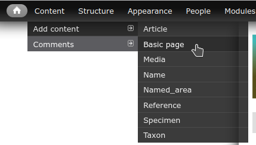

A new page opens showing the editor for editing the title and content of the new page

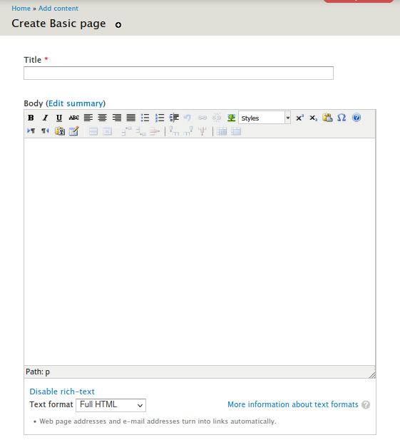

### Editing page content

Usually the WYSIWYG editor sould be activated for your data portal installation.

### Creating links

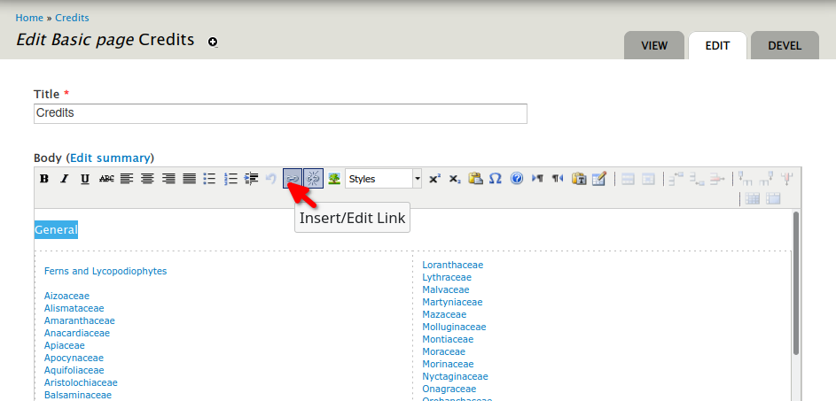

... trägt man dann diesen Pfad Slash am Anfang ein, also **/credits/genera**

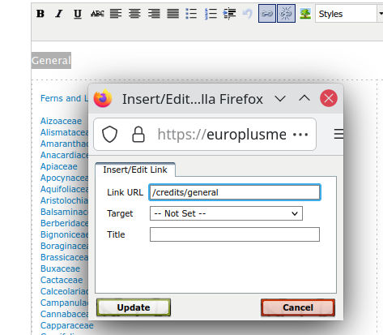

### Assigning an URL alias to a page

It is highly recommended to always define an **URL alias** for every page. Aliases replace the technical page identifier `node/{node_id}` that is otherwise used in the page URL. This optimizes the site for search engines and makes it more user friendly. The the "Credits" page you may want to use the URL alias `credits`

The corresponding form is found in the lower part of the page editors. While being on the page to be edited, click the "*Edit*" tab and scroll down:

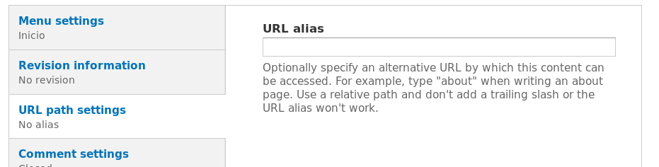{width="6.633333333333334in" height="1.68125in"}

(Example link: [http://portal.cybertaxonomy.org/salvador/node/3/edit#edit-actions](http://portal.cybertaxonomy.org/salvador/node/3/edit#edit-actions))

**HINT**: You can use the slash character to create hierarchical `/` URL aliases, like for example `glossary/area-terms`

URL aliases can be used to [create links to pages](#creating_links) and for [menu items](#adding_a_link_to_the_main_menu)

## Appearance

### Including a banner

den Banner kann man hier [[http://portal.cybertaxonomy.org/salvador/admin/appearance/settings/zen_dataportal#edit-zen-dataportal-banner]](http://portal.cybertaxonomy.org/salvador/admin/appearance/settings/zen_dataportal#edit-zen-dataportal-banner) hochladen. Banner und das EDIT-Logo sind zwei getrennte Bilder und können unabhängig von einander konfiguriert werden. \[Image size mit Logo: 852x93 pixel\]

#### Banner image

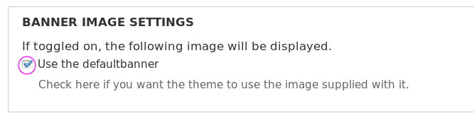{width="3.359722222222222in" height="0.8402777777777778in"}

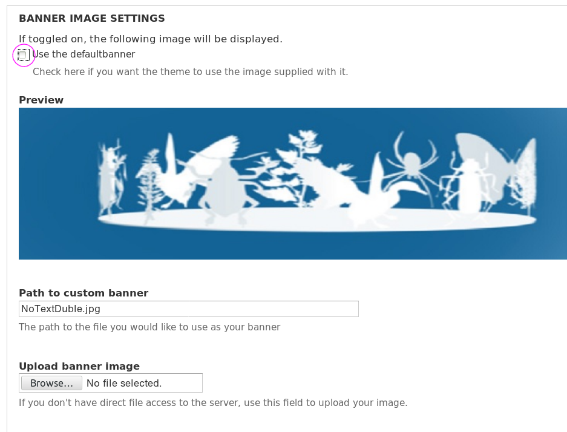{width="12.3cm"}

#### Logo abschalten:

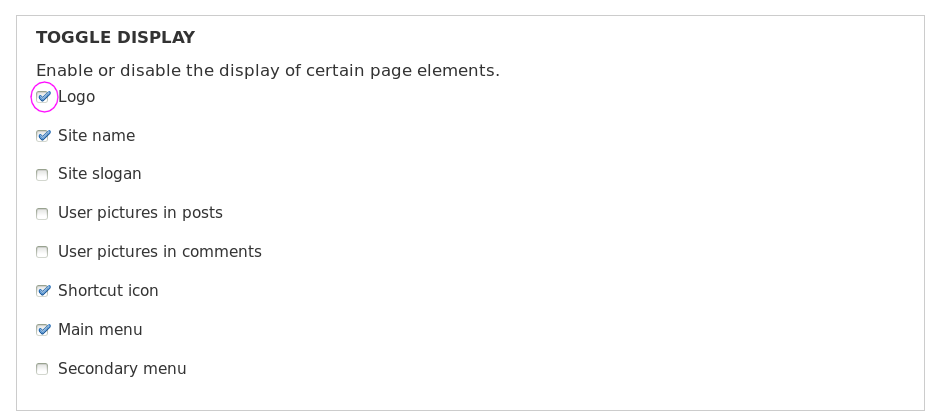{width="5.136111111111111in" height="2.2666666666666666in"}

### Site Name ändern:

[[http://test.e-taxonomy.eu/dataportal/preview/test1/admin/config/system/site-information]](http://test.e-taxonomy.eu/dataportal/preview/test1/admin/config/system/site-information) \--\> Site name

Und den Font des Texts? Das geht bisher nur über die \"User defined styles\" auf der \"[[CDM DataPortal base theme\"]](http://test.e-taxonomy.eu/dataportal/preview/test1/admin/appearance/settings/zen_dataportal) Seite:

## Menus

Here we are covering only some selected tasks which will suite for many common needs. For a full and elaborated description on the menu system please refer to 

### Adding a link to the main menu

You can add link directly into the Menu (see below: "Menus > Main menu > Add Link") or open the menu link list (see below: "Menus > Main menu" and click the button.

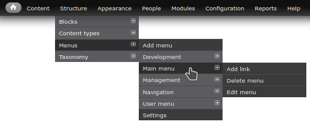

The menu item editor form will show up:

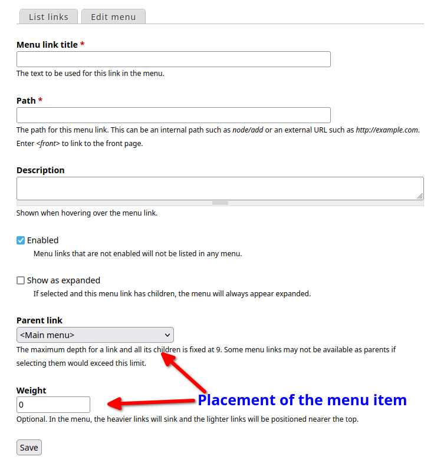{width=15cm}

1. In the Menu link title field, enter the title as it will be displayed in the menu.
1. In the Path field, enter a path for the link. This can be an internal Drupal path such as `node/add` or an external URL such as http://example.com. Enter `<front>` to link to the front page. This can also be a URL alias that has been [defined for a page](#assigning_an_url_alias_to_a_page).
1. In the Description field, enter the text that will be displayed when a user hovers over the link.
1. In the **Parent link** list, select the parent of the link. Usually you will choose `<Main Menu>` here to place the item in the menu below the site header. The  **Weight** list allows to position the item in the menu. Links with the "lightest" weight will display higher, or more left hand in a menu. Links with the same weight will display in alphabetical  order.

Click **Save**.

### Adding secondary menus

1. Hier [[http://portal.cybertaxonomy.org/salvador/admin/structure/menu]](http://portal.cybertaxonomy.org/salvador/admin/structure/menu) Add menu
2. Ein Menu ist immer als Block verfügbar und kann als solcher beliebig auf im Layout plaziert werden. Für die Alphabetleiste und Untertitelstruktur eignet sich entweder der Content- oder Highlight-Bereich .
3. Diese Menus sollen nur auf bestimmten Seiten erscheinen. Um dies möglichst einfach konfigurieren zukönnen ist es von Vorteil, wenn du für die entsprechenden Seiten hieratchische Pfad-Aliase Verwendest. Also zum Beispiel:

bibliography/a, bibliography/b, bibliography/c, \... und background/chapter1, background/chapter2 uns so weiter. In der Block Konfiguration kannst du dann die Anzeige auf Seiten einschränken die dem Pattern bibliography/\* und background/\* entsprechen

## Drupal Blocks

### Hiding or deleting a Block

**Hiding**: In the list of blocks, select a the region \'- none -\' for the corresponding block and click \"Save\" at the very bottom. [[http://test.e-taxonomy.eu/dataportal/preview/test1/admin/structure/block]](http://test.e-taxonomy.eu/dataportal/preview/test1/admin/structure/block)

**Delete**: Actually, a \'delete\' option should be displayed in the blocklist, as seen in this example:

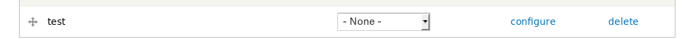{width="6.51875in" height="0.37569444444444444in"}

Außer, der Block i, select the relative  weight of the linkst ein Menü-Block! Dieser verschwindet in dem man das Menü löscht:\
[[http://test.e-taxonomy.eu/dataportal/preview/test1/admin/structure/menu/manage/menu-caryophyllales-2015/edit]](http://test.e-taxonomy.eu/dataportal/preview/test1/admin/structure/menu/manage/menu-caryophyllales-2015/edit)

### I want to get rid of the  login box

You can also hide the login box completely, instead you could add a menu item "admin" or even omit it. In the latter case a login would then only be possible for "insiders" via URL, e.g.: https://caryophyllales.org/user or https://caryophyllales.org/caryophyllales_spp/user.
The login block can be removed here: https://caryophyllales.org/admin/structure/block

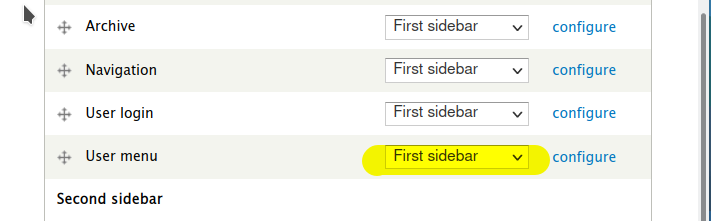

### Show a block only on selected packages

Blocks can be configured to show up on specific pages or to be hidden there.

Therfore you can configure the search, classification or any other block to shown up only on the respective pages (or ot be hidden there). Access the configuration via the admin menu "*Strcucture > Blocks*". The list of blocks will be shown, click on the "*Congure*" link to access the block editor and scroll down to the "*Pages*" form.  

(Example link: [http://portal.cybertaxonomy.org/salvador/admin/structure/block/manage/cdm_taxontree/cdm_tree/configur#edit-actions](http://portal.cybertaxonomy.org/salvador/admin/structure/block/manage/cdm_taxontree/cdm_tree/configur#edit-actions))

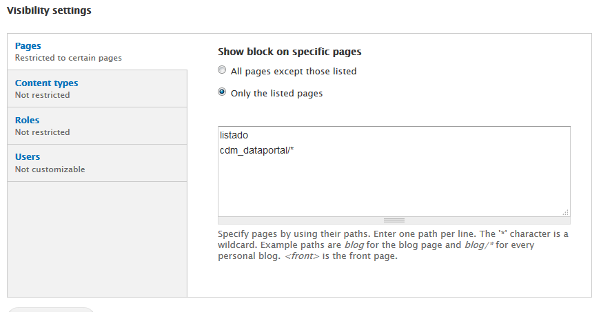{width="5.868055555555555in" height="3.0479166666666666in"}

## Bibliographic information

leere Bibliographien sollten natürlich ausgeblendet werden. Ich habe dafür gleich mal ein Ticke angelegt.

Bei dieser Gelegenheit schicke ich dir gleich die Information zum Einschalten des Bibliographie Blocks:

1. go to: [[http://caryophyllales.org/nepenthaceae/admin/config/cdm_dataportal/settings/layout]](http://caryophyllales.org/nepenthaceae/admin/config/cdm_dataportal/settings/layout)
2. Check the option: **Original Source in bibliography**

   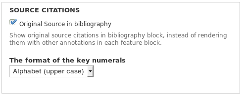{width="5.15625in" height="2.03125in"}
3. Whether the Original Source reference of a Feature Block is actually put into the bibliography also depends on the settings in the \"Taxon profile feature block settings\" ([[http://caryophyllales.org/nepenthaceae/admin/config/cdm_dataportal/settings/layout/taxon]](http://caryophyllales.org/nepenthaceae/admin/config/cdm_dataportal/settings/layout/taxon))

For more information please refer to the description on the settings \"Sources as content\" & \"Sources as content to bibliography\"

## Images

### Wie lösche ich denn hochgeladene Images wieder vom Server?

In deiner User-Seite gibt es ein Tab \"Filebrowser\":

[[http://test.e-taxonomy.eu/dataportal/preview/test1/user]](http://test.e-taxonomy.eu/dataportal/preview/test1/user)

File auswählen und im Toobar auf \"Delete\" klicken, Der Upload über dieses Tool geht nur in den Ordner \'pictures\'.

## Portal administration

### Register new users

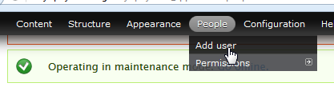{width="3.5069444444444446in" height="0.9166666666666666in"}A data portal may have restricted access, i.e. a user must log in with username and password. To register a new user, you have to have the Drupal-roles "administrator", "CDM admin" or "user admin" assigned to you.

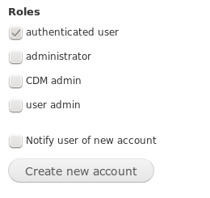{width="2.1555555555555554in" height="2.0305555555555554in"}In the Drupal menu go to *People -- Add user* and enter the user's name, email address and a preliminary password (twice).

For a normal user, make sure that under *Roles* only the (default) option *authenticated user* is checked; that user will have read-access only. You can also check the *Notify user of new account* option so the the new user receives an email notification.

Finally, click *Create new account.*

### Drupal Menu in Portal

Wenn ein User keine Admin Rechte hat, dann erscheinen auch die Tabs (Edit etc.) und das Drupal Menü nicht?

Das Drupal Menü und die Editier-Tabs erscheinen nur für Nutzer mit den Rollen Admin oder Edit Admin:

siehe:

[[http://test.e-taxonomy.eu/dataportal/preview/test1/admin/people/permissions]](http://test.e-taxonomy.eu/dataportal/preview/test1/admin/people/permissions)

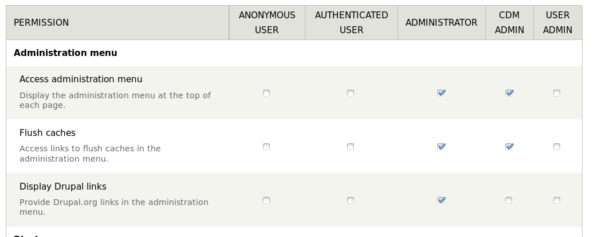{width="4.91875in" height="1.9680555555555554in"}

und die Setting in der Rubrik \"**Node**\":

### Wie richte ich einen read-only User ein?

Über Drupal Menü: People -\> Add User einen neuen User anlegen und ihm die nur die Rolle \'authenticated user\' geben, das ist auch der Standart.

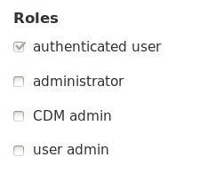{width="1.4638888888888888in" height="1.1340277777777779in"}

Das heißt also dass jeder der sich einloggen kann auch ein read-only user ist.

# CDM-specific functionality

## Overall layout of the Data Portal -- tabless taxon pages

More an more portals are configured with tabless taxon pages. A specific setup is required for this to look pleasant. The following configuration adjustments are necessary to achieve this:

-   [[http://portal.cybertaxonomy.org/roteliste_plantae/admin/appearance/settings/zen_dataportal]](http://portal.cybertaxonomy.org/roteliste_plantae/admin/appearance/settings/zen_dataportal) exclude per css the \"Synonymy\" labels in the TOC and from the Feature block:

~~~css
#synonymy h2 {
    display:none;
}
.page-part-toc-item-synonymy {
    display:none;
}
~~~

Alternatively, to completely eliminate the TOC:

~~~css
#synonymy h2 {
    display:none;
}
#page-toc {
    display:none;
}
~~~

 [[http://portal.cybertaxonomy.org/roteliste_plantae/admin/config/cdm_dataportal/settings/layout/taxon]](http://portal.cybertaxonomy.org/roteliste_plantae/admin/config/cdm_dataportal/settings/layout/taxon)

1.  Tabbed taxon page deaktivieren
2.  Unter Tabs: Synonymy tab nach oben
3.  Unter Synonymy: anzeige des akzeptierten taxons deaktivieren

## Sequence of sections with factual data

Die entsprechenden Einstellungen sind hier zu finden:

[[http://caryophyllales.org/caryophyllales_spp/admin/config/cdm_dataportal/settings/layout/taxon#edit-cdm-taxonpage-tab-weight]](http://caryophyllales.org/caryophyllales_spp/admin/config/cdm_dataportal/settings/layout/taxon#edit-cdm-taxonpage-tab-weight)

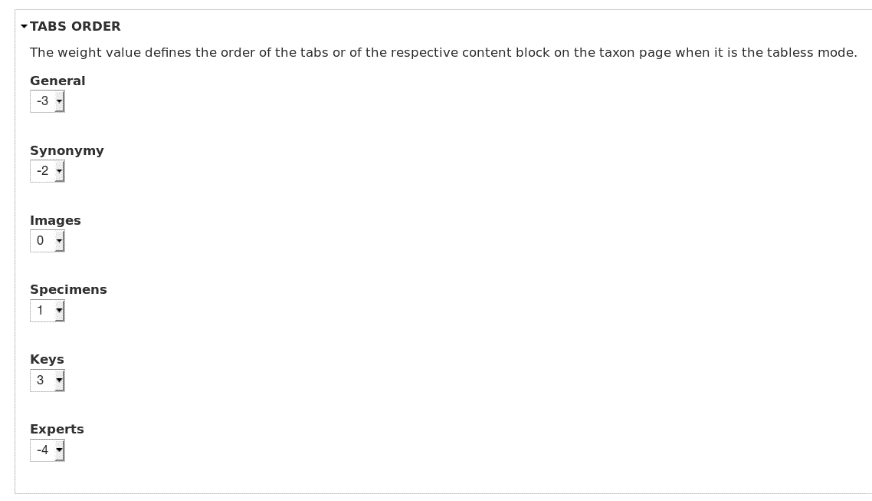{width="3.948611111111111in" height="2.265277777777778in"}

Synonymy hat einen Wert der größer dem des General Tabs ist. Damit die Synonymie vor General angezeigt wird muss der Wert kleiner sein. Bei den Nepenthes ist dies korrekt eingestellt.

## Features (blocks of "factual data" content in the General Tab)

### Defining an independent feature tree for the Portal

If you want to have different features displayed in the Portal from those that can be edited in the TaxEditor, you have to create a separate feature tree in the Editor. This can than be selected using <http://portal.cybertaxonomy.org/salvador/admin/config/cdm_dataportal/settings/layout/taxon> under Taxon profile (tab) \> Feature Blocks \> Taxon profile feature tree:.

### Feature does not show in Portal

You have to have the feature enabled in the *Feature Tree* in the TaxEditor to have them show-up under *Content* in the Portal. Go to Admin-Server-sided preferences-Factual Data-Features and mark the features to be displayed. Note that this setting is stored in the database, not locally.

### Sequence of features

The sequence of features in the Portal is determined by their sequence in the *Feature Tree*. You can drag and drop individual features to their desired position in the TaxEditor.

### Concatenation of factual data

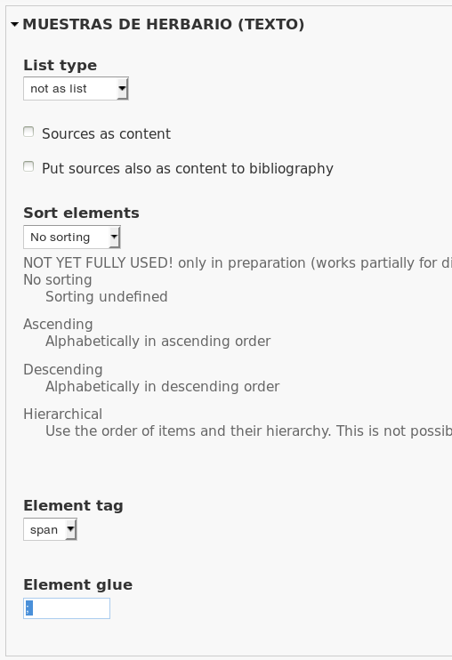{width="3.722916666666667in" height="5.434722222222222in"}

## Specific feature settings

### Language for common names

This can be configured via the theme settings in the css. Under the following URL theme settings can be overwritten:

[[http://portal.cybertaxonomy.org/salvador/admin/appearance/settings/zen_dataportal#edit-user-defined-styles]](http://portal.cybertaxonomy.org/salvador/admin/appearance/settings/zen_dataportal#edit-user-defined-styles)

In this case, the statement is the following:

~~~css
#block-cdm-dataportal-feature-common-name .language-label{
  display:none;
}
~~~

### Application area for common names

Configuration not yet implemented.

## Classification and name output

### Classification breadcrumps

The settings are located under block "Highlighted" -- "CDM Classification breadcrumps", accessible by the URL [[http://portal.cybertaxonomy.org/salvador/admin/structure/block]](http://portal.cybertaxonomy.org/salvador/admin/structure/block) (replace "salvador" with your database in the URL).

To deactivate, choose "Region" = "none".

To activate, chose region \*\*\*

Die beste Position für diesen Block ist normalerweise die Region \"Highlighted\"

### Enable or disable the full output of the accepted taxon under the page title.

[[http://portal.cybertaxonomy.org/salvador/admin/config/cdm_dataportal/settings/layout/taxon#edit-taxon-synonymy]](http://portal.cybertaxonomy.org/salvador/admin/config/cdm_dataportal/settings/layout/taxon#edit-taxon-synonymy) (replace "salvador" with the name of your database).

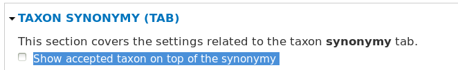{width="6.895833333333333in" height="1.0625in"}

 This also affects untabbed output, which integrates the content of the synonymy tab in the taxon page.

### Showing or hiding alternative classifications

The portal can be limited to specific classifications.

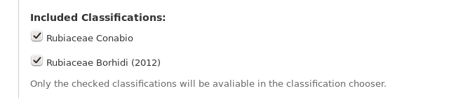{width="4.96875in" height="1.0381944444444444in"}Under http://portal.cybertaxonomy.org*/\[your portal\]/*admin/config/cdm_dataportal/settings\
check the desired classifications. The taxa in the unchecked alternative classification can still be reached in case of existing taxon relations from the accepted classification to the alternative classification (e.g. concept synonymy).\
The taxa in the unchecked alternative classifications will currently also not show up via the taxon search in the portal.

## Search settings

man kann zum Einen die Klassifikationen die in der Advanced-Search zur Verfügung stehen einschränken:

[[http://caryophyllales.org/nepenthaceae/admin/config/cdm_dataportal/settings#edit-taxontree-includes]](http://caryophyllales.org/nepenthaceae/admin/config/cdm_dataportal/settings#edit-taxontree-includes)

.. und die Suche kann auf die aktuell ausgewählte eingeschänkt werden [[http://caryophyllales.org/nepenthaceae/admin/config/cdm_dataportal/settings/layout/search#edit-simple-search-ignore-classification]](http://caryophyllales.org/nepenthaceae/admin/config/cdm_dataportal/settings/layout/search#edit-simple-search-ignore-classification) \--\> \"Ignore the chosen classification in simple search\"

 

## Add external links

Und hier die Anleitung für das Aktivieren der External Links:

1. [[http://caryophyllales.org/nepenthaceae/admin/modules]](http://caryophyllales.org/nepenthaceae/admin/modules) : Contextual Links modul aktivieren falls es nicht schon aktiv ist.
2. [[http://caryophyllales.org/nepenthaceae/admin/structure/block]](http://caryophyllales.org/nepenthaceae/admin/structure/block) : Den External Links Block in der gewünschten Region (First-Sidebar) positionieren

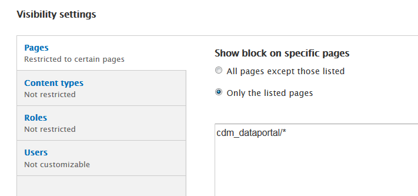{width="3.53125in" height="1.6541666666666666in"}

das Problem sind ich fehlende Permissions für deinen Account in diesen Portalen sondern ein Bug im Zen Theme, auf dem unser Theme basiert  , schon älter, aber das Problem gibt es offenbar noch immer).

Wie schon in der letzten Mail zu diesem Thema geschrieben kannst du direkt auf die Konfigurationseite des Blocks gehen um ihn für das \"CDM DataPortal base theme\" einzuschalten (\--\> \"First sidebar\"):

Das Modul selbst, also die einzelnen Links, kann man über Configuration \> CDM Dataportal \> External links einstellen.

The external links can be configured at "admin/config/cdm_dataportal/ext_links"

The order of the link entries can be adjusted by dragging them into a different position;

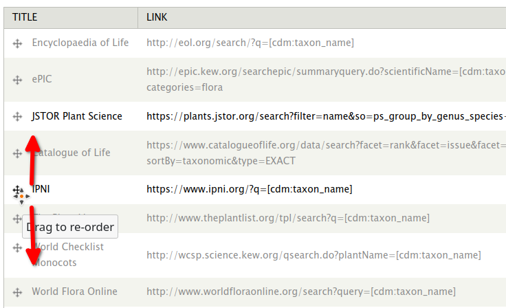

## Maps

### Define the map maximal area by bounding box:

Menu option: Configuration - CDM Dataportal - Geo & Map - Layout

Draw the box on the map or zoom in until the map is displayed as wanted

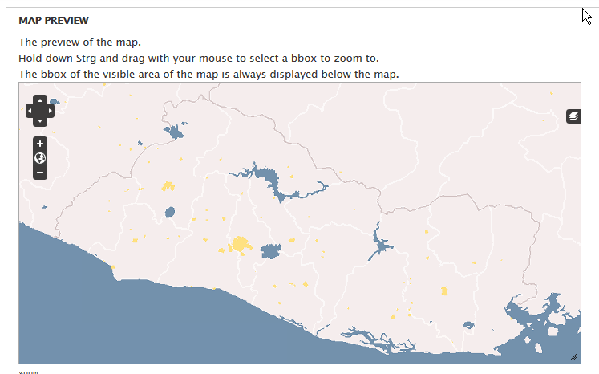{width="6.531944444444444in" height="4.075in"}

Copy the green coordinates ("degree:")

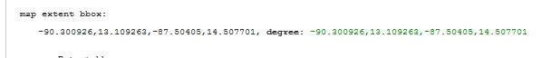{width="6.218055555555556in" height="0.6666666666666666in"}

Open *MAP SETTINGS*

Paste the coordinates into the *bounding box* field

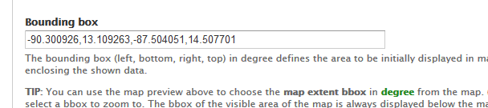{width="6.332638888888889in" height="1.40625in"}

## Images

### Image Gallery settings

Die Bilder die den Specimens zugeordnet sind können wahlweise mit in der Gallery angezeigt werden. Dazu muss der entsprechende Haken gesetzt sein:

Menu: Configuration -- CDM Dataportal -- Settings \[General\]

 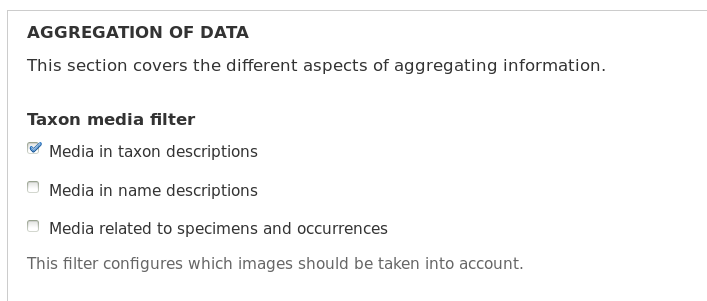{width="4.394444444444445in" height="1.8715277777777777in"}

#### Caption

Die Caption des Bildes ist immer der Title wie er als Media.title eingegebene ist.

#### Columns {#columns .list-paragraph}

[http://portal.cybertaxonomy.org/salvador/admin/config/cdm_dataportal/settings/layout/taxon](http://portal.cybertaxonomy.org/salvador/admin/config/cdm_dataportal/settings/layout/taxon) -\> Media Gallery

#### Und wie ist es, wenn man image-server images und einfache Images mischen will? {#und-wie-ist-es-wenn-man-image-server-images-und-einfache-images-mischen-will .list-paragraph}

Das ist kein Problem , sofern der \"Default image viewer\" und nicht der \"FSI Viewer\" verwendet wird. Das ist im übrigen auch die Voraussetzung dafür, dass alles anderen Features, die wir hier besprochen haben funktionieren.

#### Wie schalte ich die „Media Representations" ab?

Dafür gibt es noch keinen Knopf, aber man kann diesen Teil per css ausblenden:

hide media-representations

~~~css
#media-representations {
    display: none;
}
.cdm_media_viewer_image .media-caption h3 {
    display: none;
}
~~~

## Content

### Remove automatically created species-pages

[[http://test.e-taxonomy.eu/dataportal/preview/test1/admin/config/cdm_dataportal/settings]](http://test.e-taxonomy.eu/dataportal/preview/test1/admin/config/cdm_dataportal/settings)

Under \[yoursite\]/admin/config/cdm/cdm_dataportal/settings you can configure, if data pages are created and you can remove existing ones:\
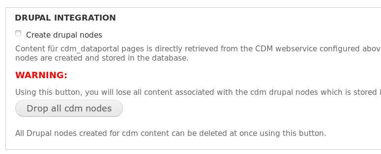{width="4.368055555555555in" height="1.7743055555555556in"}
